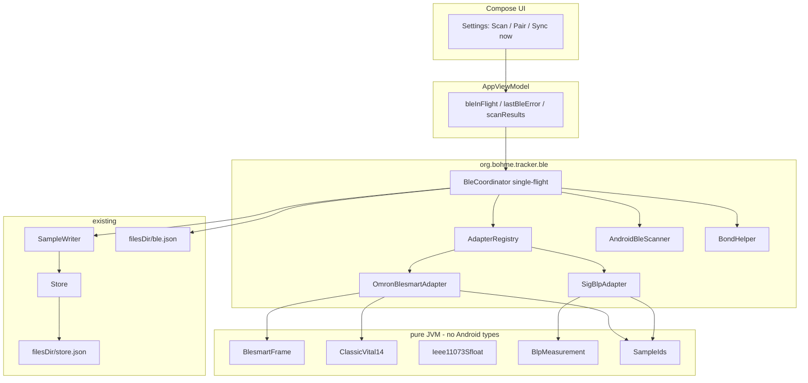
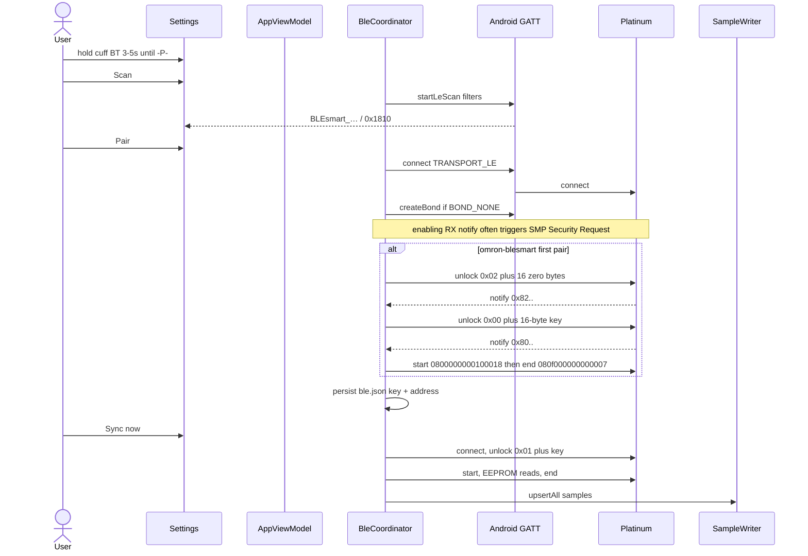
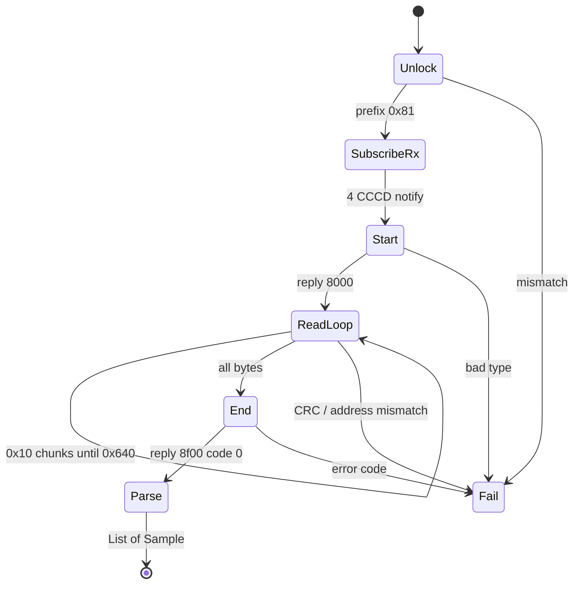

# Bluetooth device ingest for Tracker — first device: Omron Platinum BP monitor

| Field | Value |
|---|---|
| **Title** | Bluetooth device ingest for Tracker (Omron Platinum first) |
| **Author** | Engineering (placeholder) |
| **Date** | 2026-08-25 |
| **Status** | Parked — implement after basic UI |
| **Workspace** | `/home/paul/src/tracker` |
| **Package** | `org.bohme.tracker` |
| **Supersedes** | [`docs/OMRON_BLUETOOTH.md`](/home/paul/src/tracker/docs/OMRON_BLUETOOTH.md) (plan notes). Does not replace [`docs/DESIGN.md`](/home/paul/src/tracker/docs/DESIGN.md). |

This document is the implementation contract for Android Kotlin. An engineer must not invent GATT UUIDs, pairing bytes, EEPROM record maps, sample ids, or plugin seams. Constants below are copied from cited sources. Where Platinum (HEM-7343T) is not in omblepy’s matrix, the layout is taken from hass-omron’s catalog mapping of HEM-7343T → HEM-7342T and is marked as **pending HCI-snoop confirmation** (OQ-BLE-1 / OQ-BLE-3).

---

## Overview

Tracker already stores health samples in one JSON file (`filesDir/store.json`) and ingests them only through `SampleWriter.upsert(Sample)` ([`docs/DESIGN.md`](/home/paul/src/tracker/docs/DESIGN.md) KD-8, KD-10; [`Store.kt`](/home/paul/src/tracker/app/src/main/java/org/bohme/tracker/data/Store.kt); [`SampleWriter.kt`](/home/paul/src/tracker/app/src/main/java/org/bohme/tracker/ingest/SampleWriter.kt)). `Sources.BLUETOOTH = "bluetooth"` exists; no BLE code, permissions, or Settings controls exist yet.

This design adds a **small in-`:app` plugin seam** (`DeviceAdapter`) plus two first adapters:

1. **Omron BLEsmart** (proprietary EEPROM dump over classic Omron GATT) — the protocol the **Omron Platinum (US BP5450 / HEM-7343T / HEM-7343T-Z)** actually speaks, per hass-omron’s verified Platinum row and its `HEM-7342T` profile.
2. **Generic SIG Blood Pressure Profile (BLP)** collector (service `0x1810`, characteristic `0x2A35` indications) — so a later SIG cuff, and dual-stack Omron SKUs such as Bronze BP5150, work without any Omron EEPROM code.

v1 UI is Settings-only: permission rationale, Scan, list, Pair, Sync now, Forget, last error, last sync. No WorkManager, no Health Connect, no official OMRON Connect SDK, no third Gradle module.

Host **omblepy / BlueZ is research and fixture capture only**. The Android app talks to Android’s BLE stack (Fluoride), never host BlueZ.

---

## Key Decisions

New KDs start at KD-21. KD-1–KD-20 in [`docs/DESIGN.md`](/home/paul/src/tracker/docs/DESIGN.md) stay in force. This design **does not** change field ids (`systolic` / `diastolic` / `pulse`), dump format, seed rules, or WebDAV.

| # | Decision | Rationale |
|---|---|---|
| KD-8 (existing) | Caller-supplied `Sample.id`. BLE uses a deterministic id so retries do not duplicate. | Already the ingest contract. |
| KD-10 (existing, status) | All BLE samples go through `SampleWriter`. Deletes/restore stay on `Store`. **BLE-2 patches DESIGN.md:** KD-10 becomes `upsert` + `upsertAll`; Bluetooth is implemented via that interface. Dump format unchanged. | One ingest path. Live `SampleWriter` is a `fun interface` until BLE-2. |
| KD-15 (existing) | BP field ids/count immutable. `mov` / `ihb` / MAP / adapter metadata go in `Sample.extras`, never new `values` keys that the metric requires. | Graphs and manual entry stay three fields. |
| **KD-21** | **Plugin seam = `DeviceAdapter` + hard-coded `AdapterRegistry` inside `:app` package `org.bohme.tracker.ble`.** `collect(): List<Sample>` (no BP-shaped DTO). No ClassLoader, no Hilt, no `:ble` Android module. Pure parse/frame Kotlin has **zero Android types** so JVM unit tests run like `downsample` / `project`. | v1 adapters both emit `blood_pressure` samples. A later scale/glucometer is a new adapter that builds `Sample`s with its own `metricId` — Settings/`Store` still unchanged; there is no shared `RawReading`. |
| **KD-22** | **`SampleWriter` grows `upsertAll(samples: List<Sample>)`.** `Store` implements it as **validate-all + last-wins on duplicate ids (in-batch then vs existing) + one persist.** **Store never rewrites `id`.** Naive per-sample persist loop is forbidden on `Store`. | KD-8: caller supplies `id`; Store only stamps `modifiedAt`. 100 EEPROM records × full JSON rewrite is too slow at 30k samples. |
| **KD-23** | **Sample id = `bt:{adapterId}:{addressHex}:{userSlot}:{epochSeconds}:{n}`.** `addressHex` = 12 lowercase hex digits, no colons. `n` is a **0-based dump-local sequence** among records that share adapter/address/userSlot/epochSeconds, in EEPROM address order (Omron) or indication order (SIG). **Always** include `n` (a single reading is `:0`). Assigned in the adapter/`SampleIds` **before** upsert. | Survives Entry edit (`mergeEditedSample` keeps `id`). Same-second TruRead rows stay distinct without encoding live sys/dia. Retry last-wins the same ids. Do not use ring-buffer slot index. |
| **KD-24** | **v1 Omron EEPROM: read user bank 1 only** (start `0x0098`). Do **not** read `0x06D8`. `extras["userSlot"]` = `1` on those samples. Guest-mode readings are not stored on the cuff. **Does not apply to SIG BLP User ID** (separate namespace; see family A). | DESIGN A-1 is one human, one phone. Official Connect asks user 1 vs 2; we pick EEPROM bank 1 until OQ-BLE-2 says otherwise. |
| **KD-25** | **No background poll.** Sync is a Settings button. No WorkManager. | Matches existing notes and WebDAV “user-initiated” pattern. |
| **KD-26** | **Dual-stack classification after GATT discover, not from advertised name alone.** If service `0x1810` **and** characteristic `0x2A35` exist → `sig-blp`. Else if parent `ecbe3980-c9a2-11e1-b1bd-0002a5d5c51b` exists → `omron-blesmart`. Else fail. Scan still looks for both. | blood-pressure-monitor-fl: Omron Bronze BP5150 advertises `BLESmart_…` yet they claim Standard GATT. Retail Platinum is family B; we still must not skip SIG. |
| **KD-27** | **Platinum EEPROM profile = hass-omron `HEM-7342T` canonical profile**, including equivalent ids `HEM-7343T` and `HEM-7343T-Z`. Parser = hass-omron `parse_classic_vital_14` (byte-aligned), which is bit-equivalent to omblepy `hem-7342t.py` on little-endian 16-byte slots. **Do not claim HEM-7343T offsets are proven on this exact cuff** until OQ-BLE-3 snoop. | omblepy has HEM-7342T (BP7450) only. hass-omron README lists HEM-7343T / BP5450 / Platinum as verified and aliases it to 7342T. |
| **KD-28** | **EEPROM writes in v1 = pairing-key programming only** (`unlock` char `0x02` then `0x00\|\|key`). No time-sync write, no unread-counter write, no `01c0` to settings. | omblepy flags `-t` / `-n` as potentially dangerous (calibration lives in settings EEPROM). |
| **KD-29** | **Pairing key = 16 random bytes (`SecureRandom`) per device, stored in `filesDir/ble.json`, never in `store.json`.** omblepy default `deadbeaf12341234deadbeaf12341234` is a **test fixture only**, not the app default. Android OS bonding (SMP / `createBond`) is also required. | Same credential split as KD-14 (`webdav.json` vs dump). A well-known key is unnecessary once we own the bond. |
| **KD-30** | **Do not vendor OMRON Connect SDK. Do not copy UBPM (GPL) or omblepy source into the tree.** Reimplement from this document. hass-omron is MIT — still reimplement in Kotlin, do not vendor Python. | License + size. UBPM is the historical source for multi-channel RX; omblepy already re-documents it. |
| **KD-31** | **Cuff wall-clock → `recordedAt` in the phone’s `ZoneId` (injected, same as graphs).** No cuff TZ exists in the 16-byte record. If the calendar fields are invalid, skip the record (do not substitute `clock.now()` for Omron EEPROM rows). SIG BLP with no timestamp uses `clock.now()`. | DESIGN: BLE uses device timestamp if present. A skipped bad date is better than a 2000-01-01 spike on the chart. |
| **KD-32** | **`uses-feature android.hardware.bluetooth_le required=false`.** BLE is optional; Tracker without a radio still logs manually. | minSdk 26 phone without LE must not be filtered off Play/sideload. |

---

## Background & Motivation

### Current state

- Built-in metric `blood_pressure` with fields `systolic` (`mmHg`), `diastolic` (`mmHg`), `pulse` (`bpm`) — [`BuiltInMetrics.kt`](/home/paul/src/tracker/app/src/main/java/org/bohme/tracker/data/BuiltInMetrics.kt).
- `Sample(id, metricId, recordedAt, modifiedAt, source, values, extras)` — [`Models.kt`](/home/paul/src/tracker/app/src/main/java/org/bohme/tracker/data/Models.kt).
- Manual UI mints a UUID; `Store.upsert` overwrites `modifiedAt` with `clock.now()`, preserves caller `id` / `source` / `extras` / extra `values` keys.
- Settings is WebDAV only — [`SettingsScreen.kt`](/home/paul/src/tracker/app/src/main/java/org/bohme/tracker/ui/SettingsScreen.kt). Manifest has `INTERNET` only.
- [`docs/OMRON_BLUETOOTH.md`](/home/paul/src/tracker/docs/OMRON_BLUETOOTH.md) correctly split SIG BLP vs Omron BLEsmart and forbade guessing a proprietary parser. This document **fills in** that parser from cited trees.

### Why two protocol families

Retail Omron cuffs that pair with **OMRON Connect** are almost always **family B (BLEsmart / EEPROM)**. Official Omron *telehealth* docs and some EU “Smart” SKUs (X2/X4, Bronze BP5150) speak **family A (SIG BLP `0x1810`)**. Implementing only BLP will fail on Platinum. Implementing only BLEsmart will fail on the next SIG cuff and on dual-stack Omron SKUs.

A cuff bonds to **one BLE central at a time**. Tracker, OMRON Connect, and Home Assistant cannot share a pairing. The user must Forget the cuff in Android Settings (and hold Bluetooth on the cuff until `-P-`) before switching apps.

### Target cuff (product)

| Item | Value | Source |
|---|---|---|
| Retail name | Omron Platinum Wireless Upper Arm | Omron BP5450 instruction manual |
| US model | **BP5450** | Same; specs table “Model … BP5450 HEM-7343T-Z” |
| Internal | **HEM-7343T** / **HEM-7343T-Z** | hass-omron README “Supported Models”; manual model line |
| Radio | BLE, OMRON Connect | Manual §4.1 |
| Users | 2 (User ID switch), **100 readings per user** | Manual §2.8 / §5 |
| Guest | One-shot, **not stored** | Manual guest-mode note |
| TruRead | 3 consecutive measurements + displayed average | Manual §2.4 / §5 (averages marked on-device) |
| Flags | IHB (irregular heartbeat), movement | Manual; EEPROM `ihb` / `mov` bits |
| Pairing UI | Hold Bluetooth / Transfer **3–5 s** until blinking **`-P-`** | OMRON Connect pairing videos; hass-omron README; omblepy README |

**hass-omron** (MIT) lists HEM-7343T as **verified** Platinum and maps it as an equivalent of **HEM-7342T** (sold as BP7450 / 10 Series) — same endianness, addresses, record size, and `classic_vital_14` parser.

**omblepy** supports HEM-7342T with a published 16-byte record layout. It does **not** list HEM-7343T. Treat 7342T as a close sibling, not a proof of this exact SKU’s EEPROM (OQ-BLE-3).

---

## Goals & Non-Goals

### Goals

- User-initiated Scan / Pair / Sync of one Omron Platinum (and, via the same seam, any SIG BLP cuff).
- Upsert finite `blood_pressure` samples with `source=bluetooth`, cuff `recordedAt`, deterministic ids, extras for flags and device metadata.
- Plugin seam (`DeviceAdapter.collect(): List<Sample>`) so a later scale or glucometer is a new adapter class, not a Settings/`Store` rewrite.
- JVM tests for frames, CRC, record parse, SFLOAT, id scheme, session state machine (fake GATT). No live radio in CI.
- Permissions + rationale that work on minSdk 26 and API 31+.

### Non-goals (this cut)

- WorkManager / background poll / companion-device manager.
- Health Connect, Google Fit, official OMRON Connect SDK.
- EEPROM time-sync or unread-counter writes.
- Importing user slot 2 (unless OQ-BLE-2 reverses KD-24).
- TruRead-average detection as a separate sample type (all stored EEPROM rows that parse as vitals are imported; guest is not on device).
- Modern Omron stack (`0000fe4a-…`, token `0x11`/`0x91`, ECDH). Platinum is **classic** BLEsmart per hass-omron.
- Weight scales, ECG (HEM-7530T Complete), glucometers, thermometers in v1. Adding one later is a new `DeviceAdapter` that emits `Sample`s; not in these PRs.
- Netsim / Bumble fake peripheral (optional later; not required for first PR).
- Hilt, Room, Navigation, Clean Architecture layers, extra Gradle module.
- Changing KD-1–KD-20 behavior of manual entry, graphs, or WebDAV.

---

## Proposed Design

### Runtime architecture



`BleCoordinator` never opens `store.json`. It only calls `SampleWriter.upsertAll`. Factory constructs `BleDeviceStore` + `BleCoordinator` the same way as `Store` / `ConfigStore` — **not** in `Application.onCreate` (KD-13). Coordinator constructor takes **injected** `BleScanner`, `BondHelper`, and `gattFactory: (address: String) -> BleIo` (Android impls in Factory; JVM tests pass fakes).

### Package map (all under `:app`, no new module)

```
app/src/main/java/org/bohme/tracker/ble/
  DeviceAdapter.kt          // interface + BleAdvertisement + BleIo + CollectContext
  AdapterRegistry.kt        // listOf(SigBlpAdapter, OmronBlesmartAdapter)
  BleCoordinator.kt         // single-flight; takes scanner/bonds/gattFactory
  BleScanner.kt             // interface (JVM-fakeable)
  BondHelper.kt             // interface (JVM-fakeable)
  BleDeviceStore.kt         // ble.json; JVM-safe if File-based
  BlePermissions.kt         // API 26 vs 31 permission sets + location-mode check
  SampleIds.kt              // JVM id format + same-second n
  android/                  // Android impls only; unused by JVM tests
    AndroidBleScanner.kt    // implements BleScanner
    AndroidBondHelper.kt    // implements BondHelper
    AndroidGattIo.kt        // implements BleIo on BluetoothGatt
  omron/
    BlesmartUuids.kt
    BlesmartFrame.kt        // JVM
    ClassicVital14.kt       // JVM
    OmronProfile.kt         // JVM
    OmronBlesmartAdapter.kt
  sig/
    BlpUuids.kt
    Ieee11073Sfloat.kt      // JVM
    BlpMeasurement.kt       // JVM
    SigBlpAdapter.kt
app/src/test/java/org/bohme/tracker/ble/
  BlesmartFrameTest.kt
  ClassicVital14Test.kt
  Ieee11073SfloatTest.kt
  BlpMeasurementTest.kt
  SampleIdsTest.kt
  OmronSessionMachineTest.kt  // fake BleIo; notify from a second thread
  SigBlpSessionMachineTest.kt
  AdapterMatchTest.kt
  BlePermissionsTest.kt
```

Android types (`BluetoothGatt`, `ScanResult`, `Context`) stay out of `omron/BlesmartFrame.kt`, `omron/ClassicVital14.kt`, `sig/Ieee11073Sfloat.kt`, `sig/BlpMeasurement.kt`, `SampleIds.kt`, `OmronProfile.kt`, `DeviceAdapter.kt`.

### Plugin seam (normative types)

```kotlin
package org.bohme.tracker.ble

import org.bohme.tracker.data.Sample
import java.util.UUID

data class BleAdvertisement(
    val address: String,          // Android getAddress(), e.g. "AA:BB:CC:DD:EE:FF"
    val name: String?,            // local name or null
    val rssi: Int,
    val serviceUuids: Set<UUID>,  // advertised (may omit parent until GATT)
    val manufacturerId: Int?,     // 526 = Omron Healthcare if present
    val manufacturerData: ByteArray?,
)

data class GattServices(
    val serviceUuids: Set<UUID>,
    val characteristicUuids: Set<UUID>,
)

data class CollectContext(
    val address: String,
    val deviceName: String?,
    val clock: org.bohme.tracker.data.Clock,
    val zone: java.time.ZoneId,
)

/**
 * Fakeable GATT. `write` / `read` / `enable*` / `awaitNotify` run on the
 * **coordinator session thread**. Implementations must not be used from main.
 *
 * **Threading (normative — deadlock if ignored):**
 * `BluetoothGattCallback` runs on a binder thread. That callback **only**
 * completes a concurrent queue / `CompletableDeferred` (notify payload, write
 * ACK, descriptor ACK, disconnect). The session thread **only waits on that
 * queue**. Do **not** post notify payloads onto the session/waiter executor.
 * Tests inject notify from a **different** thread than the one calling `collect()`.
 */
interface BleIo {
    fun services(): GattServices
    fun write(char: UUID, payload: ByteArray, withResponse: Boolean)
    fun read(char: UUID): ByteArray
    fun enableNotify(char: UUID)     // CCCD 0x2902 = 0x01 0x00
    fun enableIndicate(char: UUID)   // CCCD 0x2902 = 0x02 0x00
    fun disableNotifyOrIndicate(char: UUID)
    /** Block the session thread up to timeoutMs for the next notify/indicate on [char], or null. */
    fun awaitNotify(char: UUID, timeoutMs: Long): ByteArray?
}

interface DeviceAdapter {
    val id: String          // "omron-blesmart" | "sig-blp"
    val label: String
    fun matchesAdvertisement(adv: BleAdvertisement): Boolean
    fun matchesGatt(gatt: GattServices): Boolean
    /** First-time key programming. OS bond is BondHelper, not this method. */
    fun pairTransport(io: BleIo, pairingKey: ByteArray)
    /**
     * Run the protocol and return ready-to-upsert [Sample]s (finite values,
     * `source=bluetooth`, KD-23 ids already assigned). Empty list is success
     * with nothing to ingest. Throw on protocol failure.
     */
    fun collect(io: BleIo, pairingKey: ByteArray?, ctx: CollectContext): List<Sample>
}

interface BleScanner {
    fun start(filters: List<ScanFilterSpec>, onResult: (BleAdvertisement) -> Unit)
    fun stop()
}

interface BondHelper {
    fun ensureBonded(address: String, timeoutMs: Long): Boolean
}

data class ScanFilterSpec(
    val serviceUuid: UUID? = null,
    val manufacturerId: Int? = null,
)
```

`AdapterRegistry.adapters` is a hard-coded list, **SIG first** then Omron, so dual-stack devices classify as `sig-blp` (KD-26).

```kotlin
object AdapterRegistry {
    val adapters: List<DeviceAdapter> = listOf(
        SigBlpAdapter,
        OmronBlesmartAdapter,
    )
    fun classify(gatt: GattServices): DeviceAdapter? =
        adapters.firstOrNull { it.matchesGatt(gatt) }
}
```

### Scan filters (OS vs callback)

`ScanFilter.setDeviceName` is **exact equality** on `ScanRecord.getDeviceName()`. Android has no OS name-prefix filter. Putting `BLEsmart_*` in a `ScanFilter` would drop every real Omron ad.

**OS `ScanFilter` list (OR — a result matches if it matches any one):**

1. Service UUID `00001810-0000-1000-8000-00805f9b34fb`
2. Service UUID `ecbe3980-c9a2-11e1-b1bd-0002a5d5c51b`
3. Manufacturer id `526` (0x020E, Omron Healthcare): `ScanFilter.Builder().setManufacturerData(526, byteArrayOf(), byteArrayOf())` — empty mask = any payload.

**Callback-side** (`ScanCallback` / `BleScanner.onResult`), after the OS union:

- Keep the hit if it already matched an OS filter.
- Additionally match local name prefix `blesmart` (case-insensitive; covers `BLEsmart_`, `BLESmart_`, `BLESmart`).
- `matchesAdvertisement` on each adapter is this callback logic (name / advertised UUID / manufacturer 526). Do **not** scan unfiltered unless live OQ-BLE-3 shows Platinum missing all three OS filters **and** MSD 526.

Many Omron cuffs put the parent UUID only in the scan response; manufacturer-id is the catch for Platinum if the scan-response UUID is omitted. Confirm MSD 526 on this cuff under OQ-BLE-3.

Classification remains **post-connect** (KD-26).

### Sample construction (both adapters)

Adapters emit `List<Sample>` (KD-21). v1 both use `metricId = "blood_pressure"`. If that metric is absent from the catalog (user deleted it), the **coordinator** does **not** upsert and does **not** re-seed (KD-18). Set `lastBleError` to `blood_pressure metric missing; restore the catalog or add the metric.`

Drop any parsed row whose systolic or diastolic is missing or non-finite (do not emit the `Sample`). If pulse is missing/non-finite, omit the `pulse` key (`Store` accepts partial `values`; KD-19 is manual UI only).

`Store.upsert` already rejects non-finite `values`. Adapters must not emit NaN.

Extras: `buildExtras` below (Data Model). Json types are `JsonPrimitive` string / boolean / number.

### Sample id (KD-23)

```
bt:{adapterId}:{addressHex}:{userSlot}:{epochSeconds}:{n}
```

Examples:

- `bt:omron-blesmart:aabbccddeeff:1:1787639100:0`
- `bt:omron-blesmart:aabbccddeeff:1:1787639100:1`  (same second, later EEPROM row)
- `bt:sig-blp:aabbccddeeff:1:1787639100:0`

Rules:

- `adapterId` ∈ { `omron-blesmart`, `sig-blp` } for v1. A future scale uses a new adapter id in the same scheme; different adapter ⇒ different id on the same MAC.
- `addressHex` = Android `BluetoothDevice.address` with `:` removed, `[a-f0-9]{12}`. If Android ever returns a UUID-style address (irrelevant on phone BLE), hash SHA-256 and take first 12 hex digits — **do not invent a second delimiter**.
- `userSlot` is decimal, no leading zeros. Omron v1 always `1` (bank 1). SIG: see family A (not filtered by KD-24).
- `epochSeconds` = `recordedAt.epochSecond` (UTC instant derived from cuff local wall time in the phone zone; SIG without timestamp uses `clock.now()`).
- **`n` is always present**, 0-based, dense among this **dump’s** records that share `(adapterId, addressHex, userSlot, epochSeconds)`, in:
  - Omron: **EEPROM address order** (walk `0x0098` upward; skipped empty slots do not consume `n`).
  - SIG: **indication receipt order**.
- Assign `n` in `SampleIds.assignSequence` **before** `upsertAll`. **Store does not rewrite ids.** Dump-local `n` does not inspect already-stored ids: a first sync of one row at T stores `:0`; a later dump with two rows at T last-wins `:0` and inserts `:1`.

Do **not** encode sys/dia/pulse in the id (Entry edit would desync identity). Do **not** use ring-buffer slot index.

**Retries:** same dump shape ⇒ same ids ⇒ `Store.upsertAll` last-wins and bumps `modifiedAt` (KD-8).

**Manual vs BLE:** a manual UUID never matches `bt:…`. Editing a BLE row in Entry **preserves `id` and `source`** (`mergeEditedSample`). User can still delete it.

### Single-flight session

One GATT session process-wide. `BleCoordinator` holds a `Mutex` (or `AtomicBoolean` + wait). If Scan/Pair/Sync is in flight, the other two buttons are disabled (`bleInFlight`, same pattern as `davInFlight`).

Timeouts (normative):

| Step | Timeout |
|---|---|
| Scan | 15 s |
| Connect | 20 s |
| Bond wait | 30 s |
| GATT discover | 10 s |
| Each BLEsmart command (then retry) | 1.0 s, **5 retries** (omblepy `_waitForRxOrRetry`) |
| Unlock notify wait | 5 s, pair-program retries 10 (omblepy `writeNewUnlockKey`) |
| SIG indication window after RACP | 8 s, then stop |
| Whole Sync | 120 s wall; then disconnect and error |

On any failure: disconnect, `lastBleError` = short reason (`scan permission denied`, `bond failed`, `unlock key mismatch`, `CRC error`, `parent service missing`, `timeout`), do not partial-commit via `upsertAll` (build the full list, then one `upsertAll`). If `upsertAll` throws, that is `lastBleError`; BLE session already ended.

### Pair / Sync user flow



Copy on Pair / Sync: exact strings in the Settings UI table (Test Plan `onNodeWithText` targets).

---

## Protocol family A — Bluetooth SIG BLP

### Citations

- Bluetooth SIG Blood Pressure Service 1.1.1; Blood Pressure Profile 1.1.1.
- GATT Specification Supplement: characteristic `org.bluetooth.characteristic.blood_pressure_measurement` (UUID `2A35`) — [bitbucket.org/bluetooth-SIG/public `gss/org.bluetooth.characteristic.blood_pressure_measurement.yaml`](https://bitbucket.org/bluetooth-SIG/public/src/main/gss/org.bluetooth.characteristic.blood_pressure_measurement.yaml).
- Assigned numbers: Blood Pressure Service `0x1810`; Blood Pressure Measurement `0x2A35`; Blood Pressure Feature `0x2A49`; Intermediate Cuff Pressure `0x2A36`; Record Access Control Point `0x2A52`.
- [derdilla/blood-pressure-monitor-fl `docs/bluetooth.md`](https://github.com/derdilla/blood-pressure-monitor-fl/blob/main/docs/bluetooth.md): any `0x1810` device; Omron X4 Smart / X2 Smart+ / **Bronze BP5150 (`BLESmart_…` yet Standard GATT)**; **do not** use download-and-delete RACP (their caveat 2.i).
- IEEE 11073-20601 / Bluetooth PHD transcoding: SFLOAT specials and mantissa/exponent layout. GSS type `medfloat16`.
- hass-omron `parser.py` **only** for kPa factor `7.50062` and measurement-status bit mapping (those bits match GSS YAML). **Do not** copy hass-omron `_decode_sfloat_le` as the SFLOAT source of truth — it does not skip NaN/NRes/±INF and would emit a finite garbage value.

### UUIDs (128-bit form used in Android)

| Role | UUID |
|---|---|
| Blood Pressure Service | `00001810-0000-1000-8000-00805f9b34fb` |
| Blood Pressure Measurement (Indicate) | `00002a35-0000-1000-8000-00805f9b34fb` |
| Intermediate Cuff Pressure (Notify, optional; **ignore in v1**) | `00002a36-0000-1000-8000-00805f9b34fb` |
| Blood Pressure Feature (Read, optional) | `00002a49-0000-1000-8000-00805f9b34fb` |
| RACP (Indicate + Write) | `00002a52-0000-1000-8000-00805f9b34fb` |
| CCCD | `00002902-0000-1000-8000-00805f9b34fb` |
| Current Time (optional; **do not write in v1**) | `00002a2b-0000-1000-8000-00805f9b34fb` |

`matchesGatt`: `0x1810 ∈ services` **and** `0x2A35 ∈ characteristics`.

`matchesAdvertisement` (callback-side, not `ScanFilter.setDeviceName`): advertised service `0x1810`, or name contains `omron` / `hem-`. Do not steal Omron classic parent-only ads without `0x1810` **at GATT classify time** (KD-26 still requires `0x2A35`).

### Session (collector)

1. Connect `TRANSPORT_LE`, discover.
2. If `BOND_NONE`, `createBond` and wait. BLP measurement is typically encrypted.
3. `enableIndicate(0x2A35)` (not notify). Write CCCD `0x02 0x00`.
4. If `0x2A52` present:
   - `enableIndicate(0x2A52)`.
   - Write RACP **Report Stored Records / All records**: `0x01 0x01` (opcode 0x01, operator 0x01).
   - Collect `0x2A35` indications until `0x2A52` **success** response or 8 s timeout.
   - If the RACP response is missing or not success: **retry once** with **Last record** `0x01 0x06`. Then fall back to the 3 s spontaneous-indication wait in step 5.
   - **Never** send opcode `0x02` (Delete Stored Records).
5. If no RACP, or after the RACP fallback: wait 3 s for spontaneous indications (some cuffs only stream the latest measurement after a reading).
6. Disable CCCDs, disconnect.
7. Parse each `0x2A35` payload independently; assign KD-23 ids in indication order.

Some SIG Omron SKUs **delete after transfer** (blood-pressure-monitor-fl table: Omron X4 Smart). We still only *read*. Warn in Settings hint: *“Some SIG cuffs erase their memory after a successful download. Platinum does not use this path.”* Platinum is family B (EEPROM dump does not clear records).

### `0x2A35` payload (little-endian, variable length)

Always present:

| Offset | Field | Size | Notes |
|---|---|---|---|
| 0 | Flags | 1 | bit field |
| 1 | Compound: Systolic | 2 | IEEE 11073 **SFLOAT** (medfloat16) |
| 3 | Compound: Diastolic | 2 | SFLOAT |
| 5 | Compound: MAP | 2 | SFLOAT; extras only, not a BP field |

**Flags** (GSS):

| Bit | Meaning |
|---|---|
| 0 | 0 = mmHg compound at offset 1; 1 = kPa compound at offset 1 (same 6 bytes; units differ) |
| 1 | Time Stamp present (7 bytes Date Time) |
| 2 | Pulse Rate present (SFLOAT) |
| 3 | User ID present (uint8) |
| 4 | Measurement Status present (uint16 bitfield) |
| 5–7 | RFU, ignore |

If bit 0 = 1 (kPa): `mmHg = round(kPa * 7.50062)` (hass-omron `parser.py`). Store `extras["unitWasKpa"]=true`.

**Date Time** (Bluetooth characteristic `org.bluetooth.characteristic.date_time`, 7 octets) when bit 1 set:

| Offset in timestamp | Field | Size |
|---|---|---|
| 0 | Year | uint16 LE |
| 2 | Month | uint8 1–12 (0 = unknown) |
| 3 | Day | uint8 |
| 4 | Hours | uint8 |
| 5 | Minutes | uint8 |
| 6 | Seconds | uint8 |

Year `0` or invalid Y-M-D h:m:s → treat timestamp as missing → `recordedAt = clock.now()` **for SIG only**.

**User ID** when bit 3 set (GSS: “defined by the service specification”; **not** an Omron EEPROM bank):

- `0xFF` (unknown) → `userSlot = 1`
- any other present id `0x00`–`0xFE` → `userSlot =` that integer (`0` stays `0`)
- characteristic has no User ID → `userSlot = 1`

**Keep the sample in v1** regardless of User ID. Put the raw byte in extras `sigUserId` (number) when the field was present. **KD-24 does not apply here** — dropping `userSlot != 1` would import **zero** rows from SIG stacks that use `0` as the first user.

**Measurement Status** (uint16 LE) when bit 4 set (GSS):

| Bit | Meaning | extras key |
|---|---|---|
| 0 | 1 = body movement | `mov` |
| 1 | 1 = cuff too loose | `cuffLoose` |
| 2 | 1 = irregular pulse | `ihb` |
| 3–4 | pulse range (00 in range, 01 high, 10 low) | `pulseRange` int 0–2 |
| 5 | 1 = improper position | `improperPosition` |
| 6–15 | RFU | ignore |

### IEEE 11073-20601 SFLOAT (16-bit, little-endian) — normative parse

Used by `0x2A35` (GSS type `medfloat16`). **Not** IEEE 754. **Not** the 32-bit FLOAT (8-bit exponent + 24-bit mantissa) used by some other PHD characteristics.

Bit layout of the `uint16` after LE decode:

- bits 0–11: mantissa, 12-bit two’s complement
- bits 12–15: exponent, 4-bit two’s complement

Special values (exponent 0, reserved mantissas):

| Raw | Meaning | Action |
|---|---|---|
| `0x07FF` | NaN | non-finite; skip that subfield |
| `0x0800` | NRes | skip |
| `0x07FE` | +INFINITY | skip |
| `0x0802` | -INFINITY | skip |
| `0x0801` | reserved | skip |

Otherwise:

```kotlin
fun sfloatLe(b0: Byte, b1: Byte): Double? {
    val raw = (b0.toInt() and 0xFF) or ((b1.toInt() and 0xFF) shl 8)
    when (raw) {
        0x07FF, 0x0800, 0x07FE, 0x0802, 0x0801 -> return null
    }
    var mantissa = raw and 0x0FFF
    var exponent = (raw shr 12) and 0x0F
    if (mantissa >= 0x0800) mantissa -= 0x1000
    if (exponent >= 0x0008) exponent -= 0x0010
    return mantissa * 10.0.pow(exponent)
}
```

Example (Bluetooth PHD transcoding white paper): systolic 114 mmHg, exponent 0, mantissa 114 → SFLOAT `0x0072` stored LE as `72 00`.

If systolic or diastolic SFLOAT is special/null → drop the whole indication. If pulse is special/null → omit `pulse` key (partial `values` is allowed on store; KD-19 is manual UI only). MAP special → omit extras MAP.

Test vectors (required):

| Bytes (hex) | Flags meaning | Expected |
|---|---|---|
| `00 72 00 4c 00 5a 00` | mmHg, no optionals, sys=114, dia=76, map=90 | values 114/76, extras map 90, `recordedAt` = now |
| `06 72 00 4c 00 5a 00 e6 07 08 19 08 05 00 48 00` | mmHg+timestamp+pulse; year 2022-08-25 08:05:00, pulse 72 | cuff clock |
| `01 01 00 01 00 01 00` | flags kPa; three × SFLOAT 1.0 (`01 00` LE) → `round(1.0 * 7.50062) = 8` mmHg | conversion path |
| `01 98 f0 65 f0 78 f0` | kPa 15.2 / 10.1 / 12.0 (mantissa 152/101/120, exponent −1, LE) → 114 / 76 / 90 mmHg | realistic convert |
| `00 ff 07 4c 00 5a 00` | sys NaN (`0x07FF` LE `ff 07`) | skip sample |

---

## Protocol family B — Omron BLEsmart (Platinum)

### Citations (do not invent extra UUIDs)

| Source | What we take |
|---|---|
| [userx14/omblepy](https://github.com/userx14/omblepy) `omblepy.py` `LEGACY_*` + class `bluetoothTxRxHandler` | UUIDs, pairing key programming, frame CRC, 16-byte chunks, commands `0000`/`0100`/`01c0`/`0f00`, retries |
| omblepy `deviceSpecific/hem-7342t.py` + `hem-7361t.py` (identical layout) | little-endian, user starts `[0x0098, 0x06D8]`, 100×`0x10`, settings 0x0010/0x0054, bitfields |
| omblepy `sharedDriver.py` `_bytearrayBitsToInt`, `getRecords` | bit extract; skip `0xFF`×recordSize; **v1 does not call** unread-counter or time-sync writers |
| omblepy README “Documentation” | command table; example read `08 01 00 02 60 26 00 4d` |
| [eigger/hass-omron](https://github.com/eigger/hass-omron) MIT `custom_components/omron/omron_ble/` | **HEM-7343T / HEM-7343T-Z equivalent of HEM-7342T**; UUID const; `parse_classic_vital_14`; session start `0800000000100018` |
| hass-omron README | Platinum verified; `-P-` pairing; one central; HCI snoop procedure |
| [ichernev/omron-rs7-intelli-it](https://github.com/ichernev/omron-rs7-intelli-it) `Readme.md` | Independent confirmation: length byte, XOR checksum, 16-byte GATT chunks, `01` writes / `81` reads (RS7 record *map* is **not** Platinum) |
| [LazyT/ubpm](https://codeberg.org/LazyT/ubpm) (GPL, **cite only**) | Multi-channel RX reassembly (length in first byte of channel 0, `(n+15)//16` channels). omblepy re-documents this; **do not paste UBPM C++**. HEM-7342T listed as BP7450, 2×100, Bluetooth. **HEM-7343T not in UBPM table.** |

### GATT UUIDs — classic stack (Platinum)

hass-omron `omron_ble/const.py` and omblepy `omblepy.py` agree. **Host writes go to the TX list; host enables notify on the RX list.** Some informal notes swap the TX/RX labels; **this table is the source of truth.**

Parent service:

```
ecbe3980-c9a2-11e1-b1bd-0002a5d5c51b
```

Unlock (write + notify):

```
b305b680-aee7-11e1-a730-0002a5d5c51b
```

**RX — device → host, Notify** (omblepy `LEGACY_DEVICE_RX_CHANNEL_UUIDS` / hass-omron `CLASSIC_STACK_RX_CHARACTERISTIC_UUIDS`):

| Ch | UUID |
|---|---|
| 0 | `49123040-aee8-11e1-a74d-0002a5d5c51b` |
| 1 | `4d0bf320-aee8-11e1-a0d9-0002a5d5c51b` |
| 2 | `5128ce60-aee8-11e1-b84b-0002a5d5c51b` |
| 3 | `560f1420-aee8-11e1-8184-0002a5d5c51b` |

**TX — host → device, Write** (omblepy `LEGACY_DEVICE_TX_CHANNEL_UUIDS` / hass-omron `CLASSIC_STACK_TX_CHARACTERISTIC_UUIDS`):

| Ch | UUID |
|---|---|
| 0 | `db5b55e0-aee7-11e1-965e-0002a5d5c51b` |
| 1 | `e0b8a060-aee7-11e1-92f4-0002a5d5c51b` |
| 2 | `0ae12b00-aee8-11e1-a192-0002a5d5c51b` |
| 3 | `10e1ba60-aee8-11e1-89e5-0002a5d5c51b` |

Do **not** use modern parent `0000fe4a-0000-1000-8000-00805f9b34fb` for Platinum. That stack is HEM-7155T-MW3 / HEM-7380T1 / etc. (hass-omron `_MODERN_OS_BONDING_BASE`). Platinum’s `DeviceConfig` does not set it, so it stays classic.

CCCD on each RX characteristic: enable **Notify** `0x01 0x00`.

`matchesGatt`: parent service present. (Unlock + 4 RX + 4 TX should also appear; if parent is present but channels missing, fail with `classic BLEsmart characteristics missing`.)

`matchesAdvertisement` (callback-side): name prefix `blesmart` **or** parent UUID advertised **or** manufacturer 526. Not an OS `ScanFilter` name.

### Pairing — two layers

Both are required (omblepy comments: enabling RX notify triggers SMP Security Request; unlock char programs an application key).

**Layer 1 — Android OS bond (SMP / Just Works).** `BluetoothDevice.createBond()` or bond triggered by the first encrypted GATT operation. User may see the system Pair dialog — Settings copy must say to accept it. Wait for `BOND_BONDED`. No PIN is specified for this family (Just Works).

**Layer 2 — 16-byte application key** on unlock UUID. omblepy default (tests only):

```
deadbeaf12341234deadbeaf12341234
```

App default: `SecureRandom` 16 bytes, persisted as 32 hex chars in `ble.json`.

Programming sequence (omblepy `writeNewUnlockKey`; hass-omron `_is_unlock_key_programming_ready` / `_is_unlock_pairing_key_ack`):

1. Cuff showing blinking `-P-`.
2. `connectGatt(..., TRANSPORT_LE)`, discover, wait until parent service is listed (omblepy polls 20×250 ms).
3. `enableNotify(RX[0])` — primes SMP.
4. `enableNotify(UNLOCK)`.
5. Write **with response** to UNLOCK: `0x02` + 16 zero bytes. Wait notify. **Success = byte0 `0x82` only** (hass-omron `_is_unlock_key_programming_ready`: “sub-type is in byte 1, **not matched**”). Retry up to 10 times, 1 s apart, while bonding completes. Failure copy: *“Could not enter key programming mode. Hold Bluetooth until -P- blinks.”*
6. Write **with response** to UNLOCK: `0x00` + 16-byte key. Wait notify. **Success = byte0 `0x80` only.** Failure: *“Failure to program pairing key.”*
7. `stopNotify` unlock and RX[0].
8. Run **startTransmission + endTransmission** once (omblepy: “necessary when the device has not been paired to any device”).
9. Persist key. Cuff display typically leaves `-P-` for a square / OK (hass-omron).

Subsequent **unlock** (omblepy `unlockWithUnlockKey`):

1. Connect (already bonded).
2. `enableNotify(UNLOCK)`.
3. Write `0x01` + 16-byte key, with response.
4. **Success = byte0 `0x81` only.** Else: *“pairing key mismatch; Forget and pair again.”*
5. `stopNotify(UNLOCK)`.

**ACK rule (normative):** match hass-omron — **byte0 only** (`0x82` / `0x80` / `0x81`). Do **not** require byte1 `0x00`. omblepy’s two-byte `8200`/`8000`/`8100` is a **fixture**, not a gate. Regression: HEM-7361T (same HEM-7342T EEPROM family; hass-omron equivalent list includes HEM-7361T variants) returned `82 0f …` (omblepy issue #31) — that payload **must succeed** programming-mode detect.

### Frame layer (host ↔ device)

ichernev + omblepy + hass-omron:

- Byte 0 = **total length in bytes** including CRC.
- Bytes 1–2 = command / response type.
- Last byte = CRC such that **XOR of every byte in the packet, including CRC, is 0**. Therefore `crc = xor(bytes[0..len-2])`.
- Split into **16-byte chunks**. Chunk `i` is written to TX characteristic `i`. Chunk `i` is received on RX characteristic `i`.
- Reassembly (UBPM/omblepy): when RX ch0 arrives, `packetSize = b[0]`, `requiredChannels = (packetSize + 15) / 16` (integer). Wait until those channel buffers are filled. Concatenate, **truncate to `packetSize`**. Then verify XOR == 0. If XOR ≠ 0, fail the command (do not silently continue).
- Channel 0 arriving while fragments are partial **starts a new frame** (hass-omron: discard stale fragments).
- Classic 4-channel writes: `writeCharacteristic` **with response** per chunk (omblepy default). Do not use WRITE_TYPE_NO_RESPONSE on this family.
- Single-channel modern devices use one UUID and `response=False`; **not Platinum**.

Command types (bytes 1–2), omblepy README:

| Host → device | Function | Typical size |
|---|---|---|
| `00 00` | start of transmission | 8 |
| `01 00` | read EEPROM | 8 |
| `01 c0` | write EEPROM | 8 + data (**v1: unlock path only, never this**) |
| `0f 00` | end of transmission | 8 |

| Device → host | Function |
|---|---|
| `80 00` | start response (omblepy: 0x18 bytes) |
| `81 00` | read response; payload at offset 6, length = byte 5 |
| `81 c0` | write response |
| `8f 00` | end response; **error code at byte 6** (0 = ok) |

Expected reply type = host command with bit 7 of byte 1 set (`command[1] | 0x80`). hass-omron discards unexpected types except always-accept `8f 00`.

**Start** (omblepy `startTransmission` / hass-omron `open_memory_session`; byte[5]=`0x10` for all devices):

```
08 00 00 00 00 10 00 18
```

XOR check: `08^00^00^00^00^10^00 = 0x18`. Expect reply type `80 00`. **If payload byte 0 ≠ 0, fail** (hass-omron `open_memory_session`; omblepy `startTransmission` only checks type `8000` — keep the stricter hass-omron check).

**End**:

```
08 0f 00 00 00 00 00 07
```

XOR: `08^0f = 0x07`. Expect `8f 00` and error code 0.

**Read `blocksize` bytes at 16-bit address A** (address and size are **big-endian** in the header):

```
08 01 00  AH AL  SZ  00  CRC
```

Example, omblepy README: read `0x26` bytes at `0x0260`:

```
08 01 00 02 60 26 00 4d
```

`08^01^00^02^60^26^00 = 0x4d`.

Reply `81 00` must echo address `AH AL`. Payload = bytes `[6, 6+SZ)`. If the frame is short, omblepy fills `0xFF`×SZ (treat as empty).

**v1 must not send `01 c0`.** (Pairing uses the **unlock characteristic**, not EEPROM write.)

Continuous read: while remaining > 0, `chunk = min(remaining, transmissionBlockSize=0x10)`, read, advance address. Platinum block size **0x10**.

Notify enable: subscribe **all four** RX UUIDs before Start (omblepy `_enableRxChannelNotifyAndCallback`). Unsubscribe after End.

### Platinum / HEM-7342T EEPROM map (hass-omron canonical + omblepy sibling)

hass-omron `device_catalog.py` `CANONICAL_DEVICE_PROFILES["HEM-7342T"]`:

```text
model: HEM-7342T
endianness: little
user_start_addresses: [0x0098, 0x06D8]
per_user_records_count: [100, 100]
record_byte_size: 0x10
transmission_block_size: 0x10
settings_read_address: 0x0010
settings_write_address: 0x0054
settings_unread_records_bytes: [0x00, 0x10]   # do not write
settings_time_sync_bytes: [0x2C, 0x3C]        # do not write
time_sync_layout: MODERN_OFFSET8              # unused in v1
record_parser: CLASSIC_VITAL_14
aggressive_gatt_timing: true
unlock_mode: CLASSIC_KEY (default)
host_pairing_mode: CUSTOM_KEY (default)
parent_service: classic ecbe3980-… (default)
equivalent_model_ids includes:
  HEM-7343T, HEM-7343T-Z, HEM-7342T-Z, HEM-7342T-CA, …
```

hass-omron README table (verified): **HEM-7343T | BP5450/Platinum Series | Upper Arm | ✅**.

omblepy `hem-7342t.py` / `hem-7361t.py` match the addresses, sizes, and little-endianness.

v1 Sync reads **user 0 only** (slot 1):

- address `0x0098`, size `100 * 0x10 = 0x0640` bytes, in chunks of `0x10`.
- Split into 100 records of 16 bytes.
- Skip record if `all bytes == 0xFF`.
- Parse with `ClassicVital14`; skip on throw / empty slot.
- Do **not** read `0x06D8` (user 2) in v1.

`aggressive_gatt_timing`: hass-omron sends a `0x02` unlock probe and short settle delays on this family. Implement: after connect, 250 ms settle; 0.75 s after CCCD subscribe (hass-omron `_NOTIFY_SUBSCRIBE_SETTLE_SEC`). Optional 0x02 probe before 0x01 unlock on Sync if 0x01 fails once.

### Record parser — `classic_vital_14` (canonical for Platinum)

hass-omron `record_parsers.py` `parse_classic_vital_14`. Comment: *“fixed little-endian on-wire layout”*; *“14-byte / 0x0E slots”* but HEM-7342T **stores 0x10-byte slots**; parser uses the **first 8 bytes** of each 16-byte slot (plus optional last-2 `_record_id`, unused by Tracker).

```text
[0]     rawSys; sys = rawSys + 25; if rawSys > 0xE1 → empty slot
[1]     dia
[2]     bpm
[3]     year = 2000 + (b[3] & 0x3F)
[4:6]   flags1 = b[4] | (b[5] << 8)   // little-endian uint16
        hour  = flags1 & 0x1F
        day   = (flags1 >> 5) & 0x1F
        month = (flags1 >> 10) & 0x0F
        ihb   = (flags1 >> 14) & 0x01
        mov   = (flags1 >> 15) & 0x01
[6:8]   flags2 = b[6] | (b[7] << 8)
        second = min(flags2 & 0x3F, 59)          // device may report 0–63
        minute = min((flags2 >> 6) & 0x3F, 59)
        cuff   = (flags2 >> 12) & 0x01           // extras; 1 = ok in hass-omron EEPROM sense
        battery= (flags2 >> 13) & 0x01
        pos    = (flags2 >> 14) & 0x03
```

Empty-slot extra guard (hass-omron): `dia==0 && bpm==0 && (year bits)==0 && flags1==0 && flags2==0` → skip.

Invalid `LocalDateTime` (month 0, day 0, …): hass-omron sets `datetime = None` and **keeps** sys/dia/bpm. **Tracker skips the whole record** (KD-31). Do **not** upsert with `clock.now()` for EEPROM rows.

`cuff` in this parser is **not** the same polarity as SIG “cuff loose”. Put EEPROM cuff in extras as `eepromCuff=int` without mapping to `cuffLoose` unless OQ-BLE-3 shows otherwise. `mov`/`ihb` **are** the Tracker extras flags.

### Equivalence to omblepy bitfields (do not implement a second parser)

omblepy `hem-7342t.py` on a 16-byte little-endian buffer, `_bytearrayBitsToInt` (MSB-style indices):

| Field | Bits | Notes |
|---|---|---|
| minute | 68–73 | |
| second | 74–79 | clamp to 59 |
| mov | 80 | |
| ihb | 81 | |
| month | 82–85 | |
| day | 86–90 | |
| hour | 91–95 | |
| year | 98–103 | +2000 |
| bpm | 104–111 | |
| dia | 112–119 | |
| sys | 120–127 | **+ 25** |

`_bytearrayBitsToInt` (`sharedDriver.py`): interpret bytes as `int.from_bytes(..., "little")`, then take bits counted from the **MSB of the whole integer**. For a 16-byte LE buffer, bits 120–127 of that MSB numbering are **byte 0**. Worked identity:

- sys 120–127 → byte[0] + 25
- dia 112–119 → byte[1]
- bpm 104–111 → byte[2]
- year 98–103 → byte[3] lower 6 bits + 2000
- mov bit 80 → flags1 bit 15
- ihb bit 81 → flags1 bit 14

**Implement hass-omron `classic_vital_14` only.** Tests must assert the omblepy bit extract on the same 16-byte fixture yields the same sys/dia/bpm/datetime/mov/ihb (guards against a swapped parser).

### Required JVM fixture (Platinum)

Constructed valid slot: sys=118, dia=76, bpm=72, 2026-08-25 08:05:00 local, mov=0, ihb=0.

```
rawSys = 118 - 25 = 0x5D
flags1 = 8 | (25 << 5) | (8 << 10) = 0x2328  → bytes 28 23
flags2 = 0 | (5 << 6) = 0x0140               → bytes 40 01
```

16-byte record hex:

```
5d 4c 48 1a 28 23 40 01 00 00 00 00 00 00 00 00
```

Empty slot: `ff` × 16 → skip. `e2 …` (rawSys > 0xE1) → skip.

Start/end/read CRC vectors must be unit-tested as hex above.

### Omron collect() state machine (fakeable)



`pairTransport`: programming sequence (0x02 / 0x00) then start+end, no EEPROM read.

Do not implement ring-buffer “new records only” (`sharedDriver.calcRingBufferRecordReadLocations`) in v1 — always full user-1 dump. EEPROM reread is how we survive official-app “each measurement once” behavior (existing notes).

---

## Android BLE environment

### Stack

The app uses `BluetoothManager.adapter`, `BluetoothLeScanner`, `BluetoothGatt`. **Not** BlueZ, not `omblepy`, not JNI.

| Environment | Radio | Use |
|---|---|---|
| Physical phone | Android Fluoride | Live pair/sync (required before claiming Platinum works) |
| CI | none | JVM fixtures only |
| Host Python | BlueZ + omblepy | Optional fixture capture (`-d HEM-7342T` sibling; `-d` has no 7343T) |
| AVD | Netsim, not PC adapter | Optional later fake peripheral |
| Waydroid | no | Out of scope |

### Permissions (minSdk 26, target 36)

Manifest:

```xml
<uses-feature android:name="android.hardware.bluetooth_le" android:required="false" />

<uses-permission android:name="android.permission.BLUETOOTH" android:maxSdkVersion="30" />
<uses-permission android:name="android.permission.BLUETOOTH_ADMIN" android:maxSdkVersion="30" />
<uses-permission
    android:name="android.permission.ACCESS_FINE_LOCATION"
    android:maxSdkVersion="30" />

<uses-permission
    android:name="android.permission.BLUETOOTH_SCAN"
    android:usesPermissionFlags="neverForLocation" />
<uses-permission android:name="android.permission.BLUETOOTH_CONNECT" />
```

- API 26–30: BLE scan requires **dangerous** `ACCESS_FINE_LOCATION`. Request at Scan time with rationale: *“Location permission is required on this Android version for Bluetooth scan. Tracker does not use GPS.”*
- API 26–30 **also** requires Location **services** on. Before scan, check `LocationManager.isLocationEnabled` (API 28+) or `Settings.Secure.LOCATION_MODE != LOCATION_MODE_OFF`. If off: `lastBleError` = *“Location must be on for Bluetooth scan on this Android version. Tracker does not use GPS.”* Do not start LE scan.
- API 31+: `BLUETOOTH_SCAN` + `neverForLocation` + `BLUETOOTH_CONNECT`. **Do not** request location. Do not require Location services.
- Never declare `ACCESS_BACKGROUND_LOCATION`. No background scan.

Runtime: if Scan tapped and permissions missing → request; on denial, `lastBleError` = `Bluetooth permission denied.`

**Adapter enable (targetSdk 36):** **Never** call `BluetoothAdapter.enable()` (deprecated API 33; **always returns false** for apps targeting Tiramisu+). If adapter is null → `lastBleError` = `Bluetooth is unavailable.` If `!adapter.isEnabled` → VM sets `bleNeedEnableAdapter = true`; **`MainActivity`** (not the ViewModel) launches `BluetoothAdapter.ACTION_REQUEST_ENABLE` via the Activity Result API (`BLUETOOTH_CONNECT` on API 31+). On cancel, `lastBleError` = `Bluetooth is off.`

### GATT threading

Two threads, not one:

| Thread | Allowed |
|---|---|
| Coordinator **session** thread (single-thread executor / `Dispatchers.IO.limitedParallelism(1)`) | `collect()` / `pairTransport()`; blocking `BleIo.write`/`awaitNotify`; `Store` / `ble.json` |
| Binder (`BluetoothGattCallback`) | **Only** complete a concurrent queue / `CompletableDeferred` (notify bytes, write/descriptor status, disconnect). **Never** run the state machine here. **Never** post notify payloads onto the session executor. |

If notify is hopped onto the same executor that is blocked in `awaitNotify`, the session deadlocks until timeout. This is the usual first-implementation failure.

Serialize **outbound** GATT ops on the session thread: wait for `onDescriptorWrite` / `onCharacteristicWrite` (via the same queue) before the next write.

`connectGatt(context, autoConnect=false, callback, BluetoothDevice.TRANSPORT_LE)`.

`onConnectionStateChange` status ≠ 0 → complete the disconnect deferred; session thread fails.

VM launches work with existing `viewModelScope.launch(io)` then calls coordinator blocking APIs from IO. Do not touch `Store` / `ble.json` on main.

Required test: session-machine `collect()` on thread A; inject notify from thread B.

### Bond helper

`BondHelper.ensureBonded(address, timeoutMs)`: if already `BOND_BONDED` return true. Else `createBond()`, register `ACTION_BOND_STATE_CHANGED`, wait `BOND_BONDED` or timeout. `BOND_NONE` after failure → false.

Forget: `BluetoothDevice.removeBond()` via hidden API is unreliable; v1 copy: *“Forget this cuff in Android Settings → Bluetooth, then tap Forget here.”* Forget in Tracker deletes `ble.json` row only. Pairing key loss ⇒ user must `-P-` again.

---

## API / Interface Changes

### `SampleWriter` (KD-22)

```kotlin
package org.bohme.tracker.ingest

import org.bohme.tracker.data.Sample

interface SampleWriter {
    fun upsert(sample: Sample)
    fun upsertAll(samples: List<Sample>)
}
```

It is no longer a `fun interface` (second method). Tests that did `val w: SampleWriter = store` still compile.

`Store.upsertAll` (**no id rewriting**):

1. If not Ready → `IllegalStateException("store not ready")` (same as `upsert`).
2. For each sample: same validation as `upsert` (blank id/metricId, non-finite values) — fail the **batch**, no persist.
3. Last-wins on duplicate ids **inside the batch** (later list element replaces earlier), then last-wins against existing samples (replace or append).
4. `modifiedAt = clock.now()` on every included sample. **Do not** mutate `id`.
5. **One** `persist`.

Same-second disambiguation is **not** Store’s job (KD-23 / `SampleIds.assignSequence`).

### `AppViewModel` / Factory

Add `ble: BleCoordinator = NoOpBleCoordinator` as the **last** constructor parameter so existing `AppViewModelTest.createVm` (`store, config, fakeDav, clock, ZoneOffset.UTC, io, Locale.US`) still compiles. Factory **always** passes a real coordinator (`ble = …`). BLE-6 tests pass `FakeBleCoordinator()` by name. Do **not** insert `ble` before `clock` (that would bind `clock` as `BleCoordinator` and break the suite).

**Do not** reset `MetricsSub.Today`, `todayFieldText`, `todayExistingIds`, or `todayError` on BLE scan/pair/sync.

New `AppUiState` fields (do not reuse WebDAV `lastError` for BLE):

| Field | Type | Notes |
|---|---|---|
| `blePermissionNeeded` | enum/none | UI shows rationale + request |
| `bleNeedEnableAdapter` | Boolean | Activity launches `ACTION_REQUEST_ENABLE` |
| `bleScanning` | Boolean | |
| `bleInFlight` | Boolean | disables Scan/Pair/Sync |
| `bleScanResults` | List of address/name/rssi/hint | |
| `bleDevices` | paired rows from `ble.json` | |
| `lastBleSyncAt` | Instant? | |
| `lastBleError` | String | empty if none |

Methods: `bleScan()`, `bleStopScan()`, `blePair(address)`, `bleSync(address)`, `bleForget(address)`, `bleRequestPermissionsResult(...)`, `bleEnableAdapterResult(granted: Boolean)`.

Factory (no Hilt, not `onCreate`):

```kotlin
val store = Store(File(app.filesDir, "store.json"), clock)
val config = ConfigStore(File(app.filesDir, "webdav.json"))
val bleStore = BleDeviceStore(File(app.filesDir, "ble.json"))
val ble = BleCoordinator(
    writer = store,
    bleStore = bleStore,
    adapters = AdapterRegistry.adapters,
    scanner = AndroidBleScanner(app),
    bonds = AndroidBondHelper(app),
    gattFactory = { address -> AndroidGattIo(app, address) },
    clock = clock,
    zone = ZoneId.systemDefault(),
)
return AppViewModel(store, config, WebDavClient(), clock, ZoneId.systemDefault(), ble = ble)
```

### Settings UI

Append a **Bluetooth** block **below** WebDAV on the existing `Column(Modifier.verticalScroll(...).padding(16.dp))`. **Do not** nest `LazyColumn` (unbounded height inside `verticalScroll`). Scan hits and paired rows: ordinary `for` + `Column` (N is tiny). No `style=`. Padding stays `16.dp`.

New `SettingsScreen` parameters (add at the end; keep WebDAV params unchanged):

| Param | Role |
|---|---|
| `bleScanResults`, `bleDevices` | lists |
| `bleScanning`, `bleInFlight` | disable buttons |
| `lastBleSyncAt`, `lastBleError` | status |
| `blePermissionNeeded`, `bleNeedEnableAdapter` | rationale / enable |
| `onBleScan`, `onBlePair(address)`, `onBleSync(address)`, `onBleForget(address)` | actions |

Update `SettingsScreenTest.defaultSettings` with no-op BLE defaults.

**Exact copy** (Test Plan `onNodeWithText` targets):

| Id | String |
|---|---|
| Heading | `Bluetooth` |
| Pair/scan hint | `The cuff bonds to one app at a time. Forget it in OMRON Connect and in Android Bluetooth settings first. On the cuff, hold Bluetooth until -P- blinks.` |
| Sync hint | `Turn the cuff on (or take a reading). Stay in range. Sync reads stored memory; it does not start a measurement.` |
| SIG memory hint | `Some SIG cuffs erase their memory after a successful download. Platinum does not use this path.` |
| Location permission rationale | `Location permission is required on this Android version for Bluetooth scan. Tracker does not use GPS.` |
| Location services off | `Location must be on for Bluetooth scan on this Android version. Tracker does not use GPS.` |
| Scan button | `Scan` (`testTag=btn-ble-scan`) |
| Sync button | `Sync now` (`testTag=btn-ble-sync-{addressHex}`) |
| Pair button | `Pair` (`testTag=btn-ble-pair-{addressHex}`) |

No new tab. No Navigation. Entry already shows non-manual `source`. BLE rows appear as `bluetooth` under Blood pressure.

---

## Data Model Changes

### Health dump (`store.json`)

No new required names. BLE samples are ordinary `Sample` objects:

```json
{
  "id": "bt:omron-blesmart:aabbccddeeff:1:1787639100:0",
  "metricId": "blood_pressure",
  "recordedAt": "2026-08-25T12:05:00Z",
  "modifiedAt": "2026-08-25T15:01:02Z",
  "source": "bluetooth",
  "values": { "systolic": 118.0, "diastolic": 76.0, "pulse": 72.0 },
  "adapterId": "omron-blesmart",
  "deviceAddress": "AA:BB:CC:DD:EE:FF",
  "deviceName": "BLEsmart_AABBCCDDEEFF",
  "userSlot": 1,
  "mov": false,
  "ihb": false
}
```

Unknown names land in `Sample.extras` on decode (KD-7). Encode emits extras then overlays known keys (`id`, `metricId`, `recordedAt`, `modifiedAt`, `source`, `values` only — adapter fields stay in extras unless we promote them; **do not** add them to `JsonCodec` known-key sets). So the JSON on disk looks like the extras keys as siblings, which `JsonCodec` already round-trips via `extras`.

`buildExtras` (adapters call this; all values `JsonPrimitive`):

| extras key | JSON type | When | Meaning |
|---|---|---|---|
| `adapterId` | string | always | `omron-blesmart` / `sig-blp` |
| `deviceAddress` | string | always | colon MAC as Android reported |
| `deviceName` | string | if non-blank | advertised name |
| `userSlot` | number | always | Omron bank 1, or SIG mapped slot (0 is legal) |
| `sigUserId` | number | SIG User ID field present | raw `0x00`–`0xFF` |
| `mov` | boolean | flag known | movement |
| `ihb` | boolean | flag known | irregular pulse |
| `cuffLoose` | boolean | SIG status bit 1 only | cuff too loose |
| `improperPosition` | boolean | SIG bit 5 | |
| `pulseRange` | number 0–2 | SIG bits 3–4 present | 0 in range, 1 high, 2 low |
| `mapMmHg` | number | SIG MAP finite | converted mmHg |
| `unitWasKpa` | boolean | SIG flags bit 0 set | |
| `eepromCuff` | number | Omron flags2 | uninterpreted; **not** mapped to `cuffLoose` |
| `batteryLow` | boolean | Omron flags2 battery bit **1** | hass-omron treats EEPROM `battery` as low-battery |

Do not put pairing keys, RSSI, or GATT payloads in extras. `deviceAddress` / `deviceName` **do** ride the WebDAV dump (see Security).

### `filesDir/ble.json` (new; not in dump)

Mirror `ConfigStore` atomic tmp+rename, missing file → empty list, garbage → empty list, **no throw**, **not** `LoadState.Corrupt`.

```json
{
  "devices": [
    {
      "address": "AA:BB:CC:DD:EE:FF",
      "adapterId": "omron-blesmart",
      "name": "BLEsmart_AABBCCDDEEFF",
      "model": "HEM-7343T",
      "pairingKeyHex": "0123...cdef",
      "userSlots": [1],
      "lastSyncAt": "2026-08-25T15:01:02Z",
      "lastError": "",
      "bonded": true
    }
  ]
}
```

Unknown keys skip (no extras passthrough required). `pairingKeyHex` never logged (override `toString` like `ConfigStore.State`).

`android:allowBackup="false"` and existing exclude-all backup XML already keep this off cloud backup.

### `upsertAll` persist cost

100 new BP samples at ~200 B each is noise next to a 6–10 MB dump. **One** rewrite. Target: Sync upsert persist **< 300 ms** at 30k existing samples (same as DESIGN persist budget).

---

## Alternatives Considered

### 1. Official OMRON Connect SDK vs reimplement

| | SDK | Reimplement (chosen) |
|---|---|---|
| Pairing | Supported | We own `-P-` + key |
| License | Closed, app-bound | MIT/docs |
| Platinum | Unknown binding | hass-omron + omblepy |
| Store | Cloud | `SampleWriter` only |

Rejected SDK: KD-30.

### 2. SIG BLP only vs BLEsmart only vs both

BLP-only fails on Platinum (retail Connect cuffs). BLEsmart-only fails on Bronze BP5150 and future SIG cuffs. **Both adapters, classify after discover** (KD-26).

### 3. `:ble-protocol` JVM module vs pure Kotlin in `:app`

`:webdav` exists because OkHttp is a library with no Android types. Parsers are a few files. A third module is ceremony. **Chosen: `:app` JVM-safe files** (same as `stats/Averages.kt`). Revisit only if a desktop importer appears.

### 4. Import both users vs user 1 only

Both users: extras `userSlot` distinguishes them; graphs mix two humans on one series (bad for A-1). User 1 only: misses household partner data. **Chosen: Omron EEPROM bank 1 only**, id still contains `userSlot` (KD-24). SIG User ID is not this filter. Reversible via OQ-BLE-2 without id migration.

### 5. WorkManager periodic sync vs button

Background BLE on API 31+ is hostile (neverForLocation scan limits, cuff radio off). **Button** (KD-25).

### 6. Companion Device Manager

Nice pairing UX, extra APIs, still need GATT. Rejected for v1 size.

### 7. omblepy default pairing key vs random

Default key lets host omblepy reuse the bond. Tracker-on-phone does not share bonds with the laptop (different Bluetooth MAC / identity). **Random per device** (KD-29). Test fixtures use the omblepy default.

---

## Security & Privacy Considerations

Still a personal log, not a medical device, not HIPAA (DESIGN). BLE adds radio and a pairing secret.

| Threat | Severity | Mitigation |
|---|---|---|
| Pairing key in `ble.json` | Med | App-private CE; not in dump; not logged; `allowBackup=false` |
| Well-known omblepy key | Low if we do not use it | Random `SecureRandom`; fixture-only default |
| Nearby BLE spoof / MITM | Med | OS bond + app key; Just Works is what the cuff offers; user must `-P-` in person |
| Health samples over BLE | Low | Existing on-cuff memory; we read, we do not broadcast |
| Location permission on API 26–30 | Med | maxSdk 30; rationale; Location **services** required; no GPS calls |
| BLE MAC / advertised name in dump | Low | `deviceAddress` / `deviceName` extras go to WebDAV. **Never** pairing keys or GATT payloads |
| Logging MACs / payloads | Med | Logcat tag `TrackerBle`: last 4 of address, byte counts, HTTP-style status. **Never** pairing key, never sys/dia/pulse |
| EEPROM write bricking calibration | High | KD-28: no `01c0` |
| One-central takeover from Connect | User-expected | Copy + Forget instructions |
| `upsertAll` duplicate flood | Low | Deterministic ids with dump-local `n`; Store last-wins, no id rewrite |
| GATT notify deadlock | High | Binder completes a queue; session thread only waits; test notify from another thread |

`ble.json` password-class field is `pairingKeyHex`. Treat like WebDAV password.

---

## Observability

- Logcat tag **`TrackerBle`**: scan start/stop (result count), connect status, bond state, parent-service found, unlock prefix, start/end replies, bytes read, sample count upserted, duration ms. No payloads, no keys.
- Settings: `lastBleSyncAt`, `lastBleError` (device-level in `ble.json` and VM).
- Do not mix into WebDAV `lastError`.
- No success toast; the BP list growing is the success signal (same as manual save).

---

## Rollout Plan

Sideload, no feature flags.

1. Land PRs BLE-1…BLE-6 (BLE-5 split 5a/5b) in order. Each mergeable with tests green.
2. `./gradlew :app:test :webdav:test` after every PR. Instrumented Settings BLE widgets when a device exists (can fake VM state without radio).
3. Live hardware gate (not CI): physical phone, cuff unpaired from Connect, `-P-`, Pair, one measurement, Sync, Entry shows `118/76 mmHg, 72 bpm` with `source` `bluetooth`, id stable on second Sync.
4. Rollback: Forget device + uninstall; `store.json` BLE rows remain until user deletes (they are data). Uninstall drops `ble.json` key ⇒ must re-pair.

If OQ-BLE-3 snoop shows a different record map, fix `ClassicVital14` / addresses in a follow-up PR **before** calling Platinum supported. BLE-1–BLE-4 (parsers, upsertAll, fake-GATT adapters, ble.json) still ship without radio.

---

## Risks

| Risk | Severity | Mitigation |
|---|---|---|
| HEM-7343T EEPROM ≠ HEM-7342T | **High** | KD-27 + OQ-BLE-3 capture; first live PR may ship seam+transport with parser tests on 7342T fixtures; do not close Platinum support until one real dump parses to the on-cuff display |
| TX/RX UUID swap | High | Table taken from omblepy+hass-omron source, not informal notes; tests write to db5b55e0 family |
| Pairing race (SMP vs 0x02) | High | omblepy 10 retries; enable RX notify first |
| CRC / multi-channel loss | Med | 5 retries; XOR check; fail session |
| API 26 location permission refusal / Location off | Med | Rationale + services check; BLE optional |
| `BluetoothAdapter.enable()` on target 36 | High | `ACTION_REQUEST_ENABLE` from Activity only |
| `upsert`×100 file rewrite | Med | KD-22 `upsertAll` |
| Dual-stack mis-classify Platinum as SIG | Med | Platinum GATT has classic parent; `0x2A35` typically absent — classify SIG only if **both** 0x1810 and 0x2A35 exist |
| Cuff TZ ≠ phone TZ | Med | Document; KD-31; no EEPROM time write in v1 |
| TruRead average + 3 rows | Low | Import all stored rows; user can delete extras |
| User 2 data never imported | Low | KD-24 / OQ-BLE-2 |
| Official app after Tracker | User-expected | One bond; Forget instructions |

---

## Test Plan (required; same PR as code)

No live radio in CI. No Midgaard. Fixtures are hex literals in tests.

### `Ieee11073Sfloat`

- `72 00` → 114.0
- specials `ff 07`, `00 08`, `fe 07`, `02 08`, `01 08` → null
- mantissa 111, exponent −1 → 11.1: raw `0xF06F` stored LE `6f f0`

### `BlpMeasurement`

- Table in family A (mmHg, kPa 1.0→8, kPa 15.2→114, timestamp, NaN skip, status bits → mov/ihb/cuffLoose/`pulseRange`)
- Pulse omitted when flag off
- User ID `0xFF` → `userSlot` 1, extras `sigUserId` 255; User ID `0x00` → **keep** sample, `userSlot` 0; User ID `2` → **keep**, `userSlot` 2
- RACP: write `01 01`; on non-success, retry `01 06`; never `02`

### `BlesmartFrame`

- CRC of start/end/example-read vectors
- Roundtrip encode read command at 0x0098 size 0x10
- Chunk 0x18-byte start **response** into 2×16 with padding then reassemble
- XOR corruption → error
- Length 0 or > 64 → error (hass-omron 4-channel cap)

### `ClassicVital14`

- Fixture `5d4c481a28234001` + 8 zero bytes → sys 118, dia 76, bpm 72, 2026-08-25T08:05:00, mov false, ihb false
- omblepy bit extract **same result**
- `ff`×16 skip; rawSys `0xE2` skip; all-zero vital skip
- second field 63 → clamped 59
- month 0 → skip (invalid date)

### `SampleIds`

- Address `AA:BB:CC:DD:EE:FF` → `aabbccddeeff`
- Always `:n`; single row → `:0`
- Two fixtures **same datetime, different sys**, EEPROM order A then B → `:0` and `:1`
- Edit sys of sample `:0` via `mergeEditedSample`; second `assignSequence` on the same dump still yields `:0` and `:1`; `upsertAll` last-wins those ids
- In-batch: two equal timestamps → two ids; Store last-wins if ids were **not** sequenced (proves Store does not invent suffixes)
- Collision vs already-stored: persist `:0` alone; later dump two same-second rows → `:0` replaced, `:1` inserted (count 2)
- Identical vitals in the same second still get distinct `:0` / `:1`
- `source=bluetooth`; extras contain adapterId/userSlot/mov
- pulse omitted → values without `pulse`
- non-finite sys → adapter drops the row (no Sample)

Omron v1: coordinator/adapter does not read bank 2. SIG `userSlot != 1` is **not** dropped.

### `Store.upsertAll`

- 3 samples, one persist (spy `onBeforeCommitFile` call count = 1)
- duplicate id in batch last-wins (**ids unchanged**)
- non-finite in any sample → IAE, file unchanged
- not Ready → ISE
- does **not** append `:{n}` or sys/dia suffixes

### Session machines (fake `BleIo`)

**Omron:** scripted notifies for unlock byte0 `0x81`, start `8000`, N read `8100` with addresses 0x0098, 0x00A8, … and one record fixture in the first chunk, rest 0xFF; end `8f00` code 0. Assert one `Sample` 118/76/72, id ending `:0`. Second run same ids.

**Notify thread:** `collect()` on thread A; deliver RX notify from thread B. Must complete; must not deadlock.

**Omron fail:** unlock byte0 `0x00` → error, no samples.

**Omron pair:** notify `82 0f …` (7361T regression) then `80 …`; assert writes `02 00…00` and `00||key`. `82 0f` is success.

**SIG:** indicate one 0x2A35; if RACP present, assert write `01 01` and no delete opcodes. Fallback test: first RACP response NAK → write `01 06`.

**Classify:** GATT with 0x1810+0x2A35 → sig-blp even if name `BLEsmart_X`. GATT with parent ecbe… and no 0x2A35 → omron-blesmart.

### Permissions helper (JVM)

- `permissionsFor(sdk=30)` includes FINE_LOCATION, excludes BLUETOOTH_SCAN
- `permissionsFor(sdk=31)` includes SCAN+CONNECT, excludes FINE_LOCATION
- `locationServicesRequired(sdk=30)` true; `sdk=31` false
- `scanBlockedReason(sdk=30, fineGranted=true, locationEnabled=false)` equals the Location-services-off copy

### Compose (androidTest, can use fake VM state)

- Settings shows `Scan`, `Sync now` after a paired fake device in state
- `onNodeWithText` for the Pair/scan hint, Sync hint, and (when `blePermissionNeeded`) the location-permission rationale — exact strings in Settings UI table
- **No radio required**. Do not assert Today tab changes after BLE actions.

### Live hardware (manual, not CI)

1. Confirm model label **HEM-7343T** or **HEM-7343T-Z** (OQ-BLE-1).
2. Forget OMRON Connect.
3. `-P-`, Pair, key programmed, cuff leaves pairing UI.
4. Take a reading on user 1, Sync, compare sys/dia/pulse/time to cuff screen.
5. Sync again: sample count unchanged (stable ids).
6. Optional: HCI snoop of Connect on a second phone (OQ-BLE-3) before trusting production.

### HCI snoop procedure (OQ-BLE-3) — from hass-omron README, adapted

1. Developer options → Bluetooth HCI snoop / stack log **Enabled** (not filtered).
2. Toggle Bluetooth off/on.
3. Pair + sync in **OMRON Connect** (cuff unpaired from Tracker).
4. Disable snoop, toggle BT.
5. `adb bugreport`; unzip; `btsnoop_hci.log` under `FS/data/log/bt/`.
6. Wireshark: confirm parent UUID, unlock writes `02`/`00`/`01`, EEPROM reads at **0x0098** / record size **0x10**, and one known reading’s sys/dia/pulse match `classic_vital_14`.
7. If addresses differ, update `OmronProfile` + fixtures; do not guess.

Host omblepy cannot select HEM-7343T; `-d HEM-7342T` is sibling-only.

---

## Open Questions

| ID | Question | Default until answered | Who |
|---|---|---|---|
| **OQ-BLE-1** | Exact cuff label: **HEM-7343T**, **HEM-7343T-Z**, or another Platinum SKU (BP5450 has shipped both internals)? | Treat **HEM-7343T and HEM-7343T-Z as the same profile** (hass-omron equivalent_model_ids). | User: photograph the rating label. |
| **OQ-BLE-2** | Import **user 1 only** vs **both users** with `extras.userSlot`? | **User 1 only** (KD-24). Id format already includes slot. | User: household use of user 2. |
| **OQ-BLE-3** | Does this exact HEM-7343T EEPROM match HEM-7342T (`0x0098` / `0x10` / `classic_vital_14`)? Are Platinum advertisements carrying **manufacturer id 526** (needed if parent UUID is scan-response-only)? | **Assume yes** (hass-omron verified Platinum) but **do not close** Platinum support until one snoop or on-cuff comparison. If MSD 526 is absent and OS UUID filters miss the cuff, only then consider unfiltered scan. | Engineer + user, live device. |
| OQ-BLE-4 | Cuff clock TZ vs phone TZ (travel)? | Phone `ZoneId` (KD-31). EEPROM time-sync remains out of v1. | User, if charts look shifted. |
| OQ-BLE-5 | Should TruRead’s on-cuff **average** row be tagged in extras if a bit is found in snoop? | Import all parsed rows; no average filter. | Only if snoop shows a distinct bit. |

Do not re-open DESIGN OQ-2/3/4 (units, pulse).

---

## References

- Product: [`/home/paul/src/tracker/docs/DESIGN.md`](/home/paul/src/tracker/docs/DESIGN.md) KD-7, KD-8, KD-10, KD-13, KD-14, KD-15, KD-18, KD-19.
- Superseded notes: [`/home/paul/src/tracker/docs/OMRON_BLUETOOTH.md`](/home/paul/src/tracker/docs/OMRON_BLUETOOTH.md).
- Ingest: [`SampleWriter.kt`](/home/paul/src/tracker/app/src/main/java/org/bohme/tracker/ingest/SampleWriter.kt), [`Store.upsert`](/home/paul/src/tracker/app/src/main/java/org/bohme/tracker/data/Store.kt), [`Models.Sample` / `Sources.BLUETOOTH`](/home/paul/src/tracker/app/src/main/java/org/bohme/tracker/data/Models.kt).
- omblepy: https://github.com/userx14/omblepy (`omblepy.py`, `sharedDriver.py`, `deviceSpecific/hem-7342t.py`, README). License file not at repo root at fetch time; reimplement, do not copy.
- hass-omron: https://github.com/eigger/hass-omron MIT — `custom_components/omron/omron_ble/{const,devices,device_catalog,record_parsers,omron_driver,parser}.py`, README supported models + HCI snoop.
- ichernev: https://github.com/ichernev/omron-rs7-intelli-it `Readme.md` (framing).
- UBPM: https://codeberg.org/LazyT/ubpm (GPL — cite; plugin table lists HEM-7342T not HEM-7343T).
- blood-pressure-monitor-fl: https://github.com/derdilla/blood-pressure-monitor-fl/blob/main/docs/bluetooth.md
- Bluetooth SIG BPS 1.1.1 / BLP 1.1.1; GSS Blood Pressure Measurement YAML; Date Time characteristic.
- Omron BP5450 instruction manual (HEM-7343T-Z): 2 users × 100, TruRead, guest not stored, OMRON Connect pairing.
- OMRON Connect pairing: hold Bluetooth 3–5 s until `-P-`; one user selection in the official app.

---

## PR Plan

Each PR is independently reviewable and mergeable. Tests land with the code. No live radio in CI. Do not construct BLE in `Application.onCreate`. BLE-5 does not start until BleIo threading, OS scan filters, `ACTION_REQUEST_ENABLE`, Location-services check, and injectable scanner/gatt are specified (they are, above).

### BLE-1 — JVM protocol parsers and ids

- **Title:** Add BLE protocol parsers (SFLOAT, BLP 0x2A35, BLEsmart frames, Platinum vital records)
- **Files/components:** `ble/sig/Ieee11073Sfloat.kt`, `BlpUuids.kt`, `BlpMeasurement.kt`, `ble/omron/BlesmartUuids.kt`, `BlesmartFrame.kt`, `ClassicVital14.kt`, `OmronProfile.kt`, `SampleIds.kt` + tests listed above
- **Depends on:** nothing (existing `:app` JVM tests)
- **Changes:** constants and parsers only. No Android imports. Hex fixtures including start/end/read CRC, `5d4c481a…` record, SFLOAT `6f f0` → 11.1, kPa vectors. omblepy bit-extract equivalence. Invalid EEPROM date → skip. **No** Settings, **no** Store changes. `SampleIds.assignSequence` lives here so BLE-3 compiles.

### BLE-2 — SampleWriter.upsertAll + DESIGN.md KD-10 patch

- **Title:** Batch SampleWriter upsert
- **Files/components:** `ingest/SampleWriter.kt` (`fun interface` → `interface` + `upsertAll`), `Store.kt`, `StoreTest.kt`, short [`docs/DESIGN.md`](/home/paul/src/tracker/docs/DESIGN.md) KD-10 + ingest-snippet patch
- **Depends on:** BLE-1 (not required to compile; can land in parallel with BLE-1)
- **Changes:** validate-all + last-wins + one persist; **no id rewrite**. Existing `upsert` tests still pass. `val w: SampleWriter = store; w.upsertAll(...)`. DESIGN.md: KD-10 = `upsert` + `upsertAll`; Bluetooth implemented via that interface. Dump format unchanged.

### BLE-3 — DeviceAdapter seam, registry, fake-GATT session machines

- **Title:** Add DeviceAdapter registry with SIG BLP and Omron BLEsmart session machines
- **Files/components:** `DeviceAdapter.kt` (`collect(): List<Sample>`), `AdapterRegistry.kt`, `OmronBlesmartAdapter.kt`, `SigBlpAdapter.kt`, `OmronSessionMachineTest.kt`, `SigBlpSessionMachineTest.kt`, `AdapterMatchTest.kt`
- **Depends on:** BLE-1, BLE-2
- **Changes:** adapters emit `Sample`s via `SampleIds` (BLE-1). Fake `BleIo` scripts for pair/unlock/read/end and SIG indications+RACP `01 01` / fallback `01 06`. Unlock ACK byte0-only including `82 0f`. Notify injected from a **second thread**. Classification KD-26. Omron does not read `0x06D8`. SIG User ID `0` kept. No `android.bluetooth`.

### BLE-4 — ble.json store

- **Title:** Add BleDeviceStore for pairing keys and last sync
- **Files/components:** `BleDeviceStore.kt`, `BleDeviceStoreTest.kt` (temp `File`, missing/garbage defaults, atomic persist, redacted `toString`)
- **Depends on:** BLE-3 (adapterId strings) — or BLE-1 if adapter ids are inlined
- **Changes:** KD-29 persistence. Not referenced by UI yet. Never encode into `JsonCodec` health dump (test: dump of a BLE sample has no `pairingKeyHex`).

### BLE-5a — Permissions, scan-filter specs, location-mode (JVM)

- **Title:** Add BLE permission and scan-filter helpers
- **Files/components:** `AndroidManifest.xml` permissions + `uses-feature` required=false, `BlePermissions.kt`, `ScanFilterSpec` (already in `DeviceAdapter.kt` if BLE-3 landed), `BlePermissionsTest.kt`
- **Depends on:** BLE-3 optional; can use the spec types from BLE-1/`DeviceAdapter` once present
- **Changes:** 26-vs-31 permission sets; Location-services required on SDK ≤ 30; OS filter list = `0x1810` OR parent UUID OR manufacturer 526. **No** `BluetoothAdapter.enable()`. Factory still unwired.

### BLE-5b — Coordinator + injectable scanner/bond/gatt

- **Title:** Add BleCoordinator with fakeable scanner, bond helper, and GATT factory
- **Files/components:** `BleCoordinator.kt`, `BleScanner.kt`, `BondHelper.kt`, `android/AndroidBleScanner.kt`, `AndroidBondHelper.kt`, `AndroidGattIo.kt`, coordinator tests with JVM fakes
- **Depends on:** BLE-3, BLE-4, BLE-5a, existing `Store`
- **Changes:** constructor `(writer, bleStore, adapters, scanner, bonds, gattFactory, clock, zone)`. Single-flight Scan/Pair/Sync/Forget. Binder-queue GATT (Issue 2). **Factory not wired yet** (DESIGN PR-3 style).

### BLE-6 — Settings UI and ViewModel wiring

- **Title:** Add Bluetooth Scan/Pair/Sync controls to Settings
- **Files/components:** `AppViewModel.kt` + Factory (`ble: BleCoordinator = NoOpBleCoordinator` as **last** ctor param), `AppUiState` BLE fields including `bleNeedEnableAdapter`, `SettingsScreen.kt` extra params, `MainActivity.kt` SettingsTab + `ACTION_REQUEST_ENABLE` launcher, `AppViewModelTest.createVm` unchanged (default no-op), BLE-6 tests pass `ble = FakeBleCoordinator()`, `SettingsScreenTest.defaultSettings` BLE no-ops, README Bluetooth paragraph
- **Depends on:** BLE-5b
- **Changes:** exact copy from Settings UI table; scan hits as `Column` not `LazyColumn`. Do not change Today. Update [`docs/OMRON_BLUETOOTH.md`](/home/paul/src/tracker/docs/OMRON_BLUETOOTH.md) to point at this design. README: pairing `-P-`, one-central, no WorkManager, Platinum layout assumed = HEM-7342T until snoop.

**Parallel:** BLE-1 ∥ BLE-2; BLE-4 alongside BLE-3 once adapter ids are stable (`omron-blesmart`, `sig-blp`).

**Done when:** JVM tests green; Settings can scan (permission-gated; Location services on API 26–30); Pair programs a random key into `ble.json`; Sync upserts deterministic BP samples with `:n` ids; second Sync does not duplicate; SIG adapter tested on fixtures; Platinum parser matches hass-omron/omblepy fixtures; **live HEM-7343T confirmation tracked by OQ-BLE-3**, not blocked on BLE-1–BLE-6 merge except the support claim in README must say “Platinum layout assumed = HEM-7342T until snoop.”
