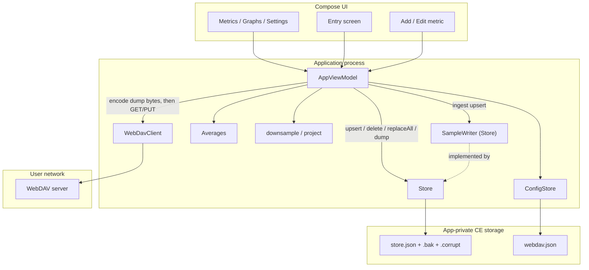
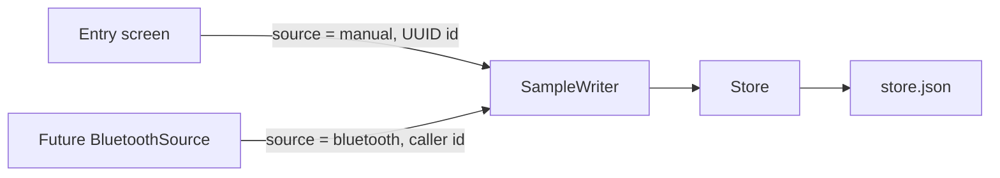
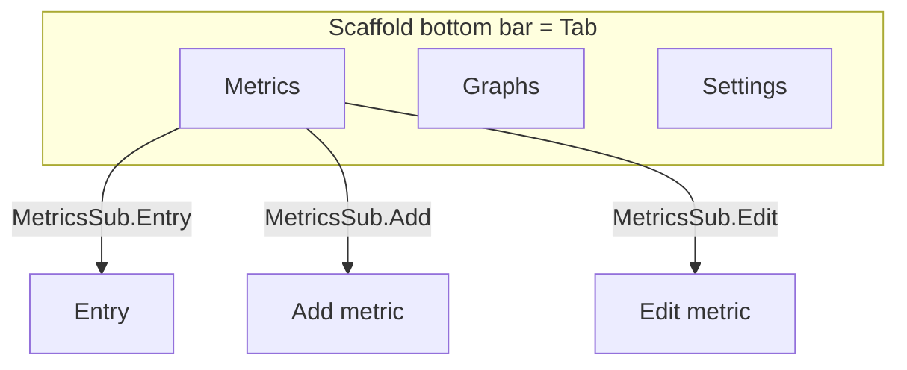
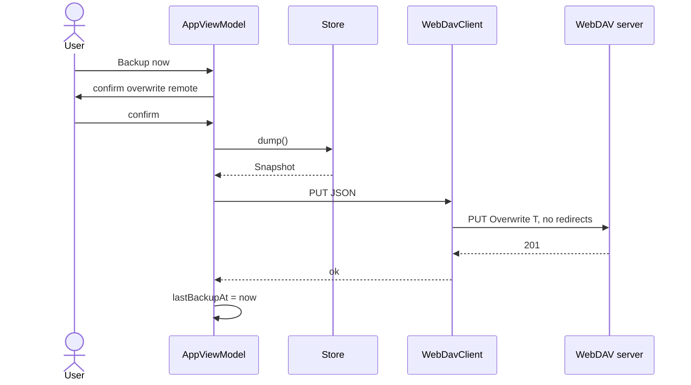
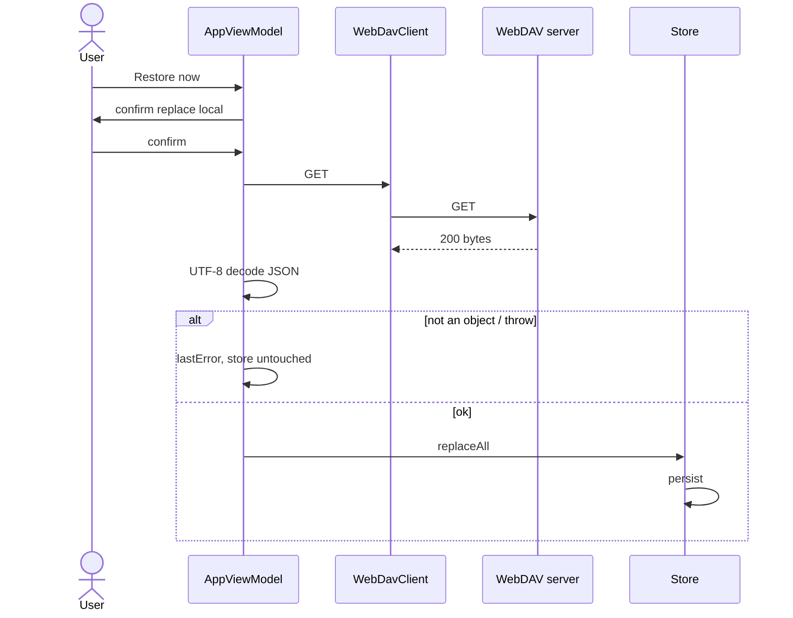

# Health Metrics Tracker — Android App Design

| Field | Value |
|---|---|
| **Title** | Health Metrics Tracker |
| **Author** | Engineering (placeholder) |
| **Date** | 2026-08-24 |
| **Status** | Approved |
| **Workspace** | `/home/paul/src/tracker` (empty greenfield) |
| **Application id / package** | `org.bohme.tracker` (decided) |
| **Launcher name** | Tracker (decided) |

This document is the implementation contract. An engineer should not need to invent product behavior. OQ-2/3/4 (glucose unit, weight unit, pulse) are **resolved** below; there are no remaining Open Questions.

---

## Overview

A single-user Android app for manually logging a small set of health time series (weight, BHB, blood glucose, blood pressure), graphing them over a chosen window with calendar averages, and dumping the whole dataset as one JSON file to a user-owned WebDAV server. The user can add further metrics; each metric is a label plus one or more named numeric fields per sample (blood pressure is the built-in multi-field case: systolic, diastolic, and pulse).

Local truth is an atomic JSON file in app-private storage. WebDAV is backup and restore of that same JSON, not the live database. Ingest is a single `SampleWriter` so a later Bluetooth source can upsert the same `Sample` records without a second store. The stack is Kotlin, Jetpack Compose, a few dozen source files, no DI framework, no Room, no Navigation component, no Clean Architecture layers.

---

## Key Decisions

| # | Decision | Rationale |
|---|---|---|
| KD-1 | **Kotlin + Jetpack Compose + Material 3.** Single-activity `MainActivity`. No XML UI, no Fragments, **no `navigation-compose`**. Padding is `16.dp` via `Modifier`. | Default Android UI stack. Three tabs + one optional Metrics sub-screen fit in `AppViewModel` state. A Navigation graph is a second back-stack model. |
| KD-2 | **`minSdk 26`, `targetSdk` / `compileSdk` 36.** JDK 17. | `java.time` without core-library desugaring. Bump compile/target to current stable if 36 is already superseded at implementation. |
| KD-3 | **Package / applicationId `org.bohme.tracker`. Launcher label `Tracker`.** Two Gradle modules: `:app` and `:webdav` (`:webdav` added in PR-4, not PR-1). | Workspace is `/home/paul/src/tracker`. `:webdav` is a pure JVM OkHttp helper. |
| KD-4 | **Local store = one pretty-printed JSON file** `filesDir/store.json`, loaded fully into memory. No SQLite, no Room, no DataStore for samples. | Health volume is tiny. The dump format *is* the live format. |
| KD-5 | **WebDAV = thin OkHttp client** (`GET`/`PUT` of one file URL, HTTP Basic). **`followRedirects = false`**. Not sardine-android. No PROPFIND, LOCK, COPY, MKCOL in v1. | We need overwrite-a-known-path. 3xx is `HttpException` (no cross-host Basic leak). |
| KD-6 | **Charts = Compose `Canvas` + pure plot math** (`downsample`, `bucketMeans`, `project` returning `Px`, not Compose `Offset`). No Vico/MPAndroidChart in v1. | Range is a data filter. JVM tests must not need Compose. |
| KD-7 | **Dump JSON: named fields, no `formatVersion`.** Unknown names **skip on decode and pass through on encode** via `extras: Map<String, JsonElement>` on `Snapshot`, `MetricDef`, `FieldDef`, and `Sample`. Extra keys inside `values` stay in `values` if they are finite numbers. Known names overwrite extras on encode if they collide. | Portable extras rule. A v1 restore→backup of a v2 dump must not strip `_ble` / `note` / sibling keys. |
| KD-8 | **Sample identity = caller-supplied string `id` + `recordedAt` Instant.** `modifiedAt` set by `Store.upsert` to `clock.now()`. Manual UI generates a UUID. Future BLE may pass a deterministic id (device + instrument time) so retries do not duplicate. | `id` is the upsert key. The interface does not mint ids. |
| KD-9 | **Metric definition = `id`, `label`, `fields[]` (`id`, `label`, `unit`) plus `extras`.** Built-in ids are stable tokens; user metrics and user field ids are UUIDs. Built-in **weight** field id `lb`, unit string **`lb`**. Built-in **glucose** field id `mg_dl`, unit string **`mg/dL`**. Both unit strings are editable on the metric (no conversion). Built-in **blood pressure** is three fields: `systolic`, `diastolic` (`mmHg`), `pulse` (`bpm`). | Units are display strings, not a converter. User resolved OQ-2/3/4. |
| KD-10 | **Ingest seam = `SampleWriter.upsert(Sample)`.** Manual entry is the only v1 source (`source = "manual"`). Bluetooth is not implemented. `deleteSample` and `replaceAll` stay on `Store`, not on the ingest interface. | One ingest path. Deletes/restore are store operations, not ingest. |
| KD-11 | **WebDAV = last-write of the whole dump file, user-initiated, both directions confirmed.** Backup `PUT`s after confirm: *“Overwrite the server copy with local data? The current file at this URL will be lost.”* Restore `GET`s and **replaces** local after confirm. No background sync, no union, no tombstones. Two-device concurrent use is unsupported. | Dump/restore for safety. Union-without-deletes cannot honor local deletes. Unconfirmed Backup of a seeded-empty catalog is the failure mode the product exists to prevent. |
| KD-12 | **Averages = arithmetic mean of in-range points, local-TZ calendar buckets** (day / ISO week / calendar month). Pipeline: filter `[start,end)` → `bucketMeans` (clamp each mean `t = max(bucketOrigin, start)`) → downsample → `project`. Partial buckets = visible points only. Empty buckets omitted. | “Weekly, monthly, and similar.” A Wednesday 7d window’s ISO-week origin is Monday; clamping keeps overlay `t` inside the project domain. |
| KD-13 | **No DI framework.** `TrackerApp` exposes `filesDir` + a process `Clock` only. `AppViewModel.Factory` constructs `Store`, `ConfigStore`, `WebDavClient` and **`load()`s on `Dispatchers.IO`**. Never `runBlocking` / never `Store` on the main thread. | Hilt is ceremony. `Application.onCreate` must not parse 10 MB JSON. |
| KD-14 | **Credentials live in `filesDir/webdav.json`, never in the health dump.** `android:allowBackup="false"` plus `data_extraction_rules.xml` / `fullBackupContent` excluding all files. | WebDAV is the only off-device copy. |
| KD-15 | **Samples: add / edit / delete. Metrics: create; edit `label`/`unit` strings, per-field **color**, and graph min/max; delete cascades samples (confirm names the count).** Field ids and field count/order are immutable after create. | A unit typo must not require deleting the series. Changing field identity would orphan `values` keys. Graph axis is per metric (KD-20), not per field. Color is per field (each plotted series). |
| KD-16 | **HTTP Basic, HTTPS preferred, optional “Allow insecure TLS” default off.** No OAuth. User-installed CAs are **not** trusted (API 24+ default network security); the insecure toggle is the only self-signed path. Username containing `:` is rejected. | Nextcloud/NAS is Basic. Trusting user CAs would be a second TLS policy; we do not add it. |
| KD-17 | **Navigation: 3-tab root held on `AppViewModel` (`Tab` + `MetricsSub`).** Switching tabs **preserves** Metrics sub-screen and form buffers. No `NavHost`. | Standard bottom-bar behavior without a navigation library. |
| KD-18 | **Seed built-ins iff `store.json` and `store.json.bak` are both absent.** An existing file, including `{}` / `"metrics": []`, is truth and is **not** re-seeded. Unreadable files are Corrupt (no seed, no persist, Backup disabled) until Reset or Restore. | Seed-on-empty-catalog would resurrect built-ins after the user deleted them, and would PUT an empty catalog over a good remote dump. |
| KD-19 | **Every `FieldDef` is required on manual entry.** There is no `required` flag on the type. Store/codec/graphs accept partial `values` maps (BLE / old dumps). | A boolean the Add-metric UI does not collect is a schema trap. |
| KD-20 | **v1 multi-field metrics share one y-axis.** Blood pressure plots systolic, diastolic, and pulse on **one** chart / one y-axis. Pulse (`bpm`) sits low on a scale dominated by mmHg; **do not** split charts or add a second axis. Add-metric copy: *“All fields share one graph axis; use the same unit.”* Do not overlay two *metrics* on one canvas. | User asked for pulse on the BP metric. Splitting per field is extra UI. |

---

## Background & Motivation

The workspace `/home/paul/src/tracker` is empty. There is no existing app, schema, or library to extend.

The product is a personal log: a few numeric readings per day, entered by hand, kept for years, graphed, and copied to a server the user already runs. That rules out a hosted backend, a medical-device / HIPAA program, and Bluetooth in v1.

Pain if we overbuild: Room, use-cases, Navigation, and a chart SDK would dwarf the actual behavior. Pain if we under-specify: load/seed failure, restore of non-JSON, extras stripping, and the chart pipeline would get invented differently in every PR.

---

## Goals & Non-Goals

### Goals

- Ship an Android app that stores, graphs, and WebDAV-dumps health samples.
- Built-in metrics on **true first launch** (both store files absent): weight, BHB, blood glucose, blood pressure.
- One entry screen per metric (all fields, timestamp, recent samples, edit/delete).
- User-defined metrics: label + 1..N fields (each field label + unit). After create, only label/unit strings are editable.
- Graphs: one-or-more metrics, configurable time range, optional daily/weekly/monthly mean overlay.
- Local durability across process death and reboot (`store.json`).
- Dump and restore the dataset as one JSON document on a configured WebDAV URL, both with overwrite confirms.
- `SampleWriter.upsert` as the ingest API for sample inserts/updates, so Bluetooth can be added later without a second store path.
- Tests for storage, metric catalog, averaging, JSON extras roundtrip, WebDAV client, restore-replace, persist-failure rollback; Compose smoke for the main screens.

### Non-goals (v1)

- Bluetooth, BLE, USB, Health Connect, Google Fit, Apple Health. Parked plan: [`docs/BLUETOOTH.md`](BLUETOOTH.md). Do not start until basic UI is done.
- Background or automatic WebDAV sync, WorkManager periodic backup.
- Two-device merge, sample-level etags, conflict UI, “Restore and merge”.
- Accounts, OAuth, Nextcloud login flow beyond URL + Basic.
- Unit conversion (kg↔lb, mg/dL↔mmol/L). A unit is a label; editing it does not convert numbers.
- Changing a metric’s field ids or field count after create (delete + recreate only).
- Adding a `required` flag or optional-field UI.
- Medical interpretation, coaching, AI, social, sharing, PDF export.
- Pinched-zoom charts, dual y-axes, pie/bar charts, overlaying two metrics on one canvas.
- Encrypted dump, EncryptedSharedPreferences, client-side crypto other than platform CE userdata.
- Play Store listing, IAP, analytics, Crashlytics.
- iOS / desktop.
- `navigation-compose`, Hilt/Koin, Room.

---

## Assumptions

| ID | Topic | Default until overridden |
|---|---|---|
| A-1 | One human, one phone. | Restore may destroy local-only samples. Shown in the Restore confirm. Backup may destroy the remote dump. Shown in the Backup confirm. |
| A-2 | WebDAV URL is the **file** URL of the dump, not a directory. | User creates the parent folder in Nextcloud/NAS. v1 does not `MKCOL`. |
| A-3 | Built-in units: weight **`lb`** (field id `lb`), BHB **mmol/L**, glucose **`mg/dL`** (field id `mg_dl`), BP **mmHg** + pulse **bpm**. Glucose and weight unit **strings** are editable via Edit metric. | Resolved OQ-2/OQ-3. Editing a field unit does not convert old numbers. No Settings unit picker. |
| A-4 | Blood pressure is three required-on-entry fields: systolic, diastolic, pulse. | Resolved OQ-4. Field ids/count immutable after seed (KD-15). |
| A-5 | Time range presets are **N local calendar dates including today**, not 7×24 h Instant windows. Custom is `[from 00:00, to+1 00:00)` in the device zone. | Health UIs mean calendar days. |
| A-6 | Decimal **input** uses `NumberFormat` for the device locale. JSON `values` numeric **strings** parse as English/JSON (`toDouble()`), not locale. | Dump files are not locale-dependent. |
| A-7 | Self-signed NAS: user must enable “Allow insecure TLS.” User CAs are not trusted. | Default off. |
| A-8 | `usesCleartextTraffic=true` is **global** (any `http://` URL). | A LAN-only network-security-config is extra XML we do not add. Prefer https in the Settings hint. |

---

## Proposed Design

### Sizing (so we do not over-engineer)

| Quantity | Estimate |
|---|---|
| Metrics | 4 built-in + a handful of user metrics |
| Samples | ~4 metrics × 2/day × 365 × 10 years ≈ **30k** |
| JSON size | ~200 B/sample → **~6–10 MB** worst case |
| Process memory | Entire snapshot in RAM; well under 50 MB |
| Local save | Rewrite whole file **off main thread**; target **< 50 ms** typical, **< 300 ms** at 30k |
| Graph | Filter + bucket 30k points; target **< 100 ms**. Draw ≤ one value per x-pixel |
| WebDAV payload | Same as `store.json`, typically **< 1 MB** for several years of 1–2 readings/day |

A streaming DB is not justified. Pretty-print + full-tree parse at 10 MB is acceptable **on `Dispatchers.IO`**, not in `Application.onCreate`.

### Module and package map

End state (after PR-8). PR-1 is `:app` only; PR-4 adds `:webdav`.

```
/home/paul/src/tracker/
  settings.gradle.kts          // PR-1: include(":app") only. PR-4: also include(":webdav")
  build.gradle.kts
  gradle.properties
  .gitignore                   // build/, .gradle, local.properties, .idea, *.iml
  app/
    build.gradle.kts
    src/main/AndroidManifest.xml
    src/main/res/xml/
      data_extraction_rules.xml
      backup_rules.xml         // fullBackupContent exclude-all (API < 31)
    src/main/java/org/paul/tracker/
      TrackerApp.kt            // Application; filesDir + Clock; does not construct Store
      MainActivity.kt
      AppViewModel.kt          // one VM; Factory constructs Store/Config/WebDav and loads IO
      data/
        Models.kt              // types + extras + LoadState + mergeEditedSample/Metric
        BuiltInMetrics.kt
        JsonCodec.kt
        Store.kt               // implements SampleWriter
        ConfigStore.kt         // webdav.json (PR-8)
      ingest/
        SampleWriter.kt
      stats/
        Averages.kt            // RangePreset, rangeBounds, minSelectedRecordedAt, bucketMeans, defaultSelectedMetricIds, selectionAfterDelete
        Format.kt              // formatSampleValues
      ui/
        MetricListScreen.kt
        AddMetricScreen.kt     // also used for Edit metric (label/unit)
        EntryScreen.kt
        GraphScreen.kt
        Chart.kt               // Canvas wrapping downsample/project
        SettingsScreen.kt
        Theme.kt
    src/test/java/org/paul/tracker/
    src/androidTest/java/org/paul/tracker/
  webdav/                      // PR-4
    build.gradle.kts
    src/main/java/org/paul/tracker/webdav/WebDavClient.kt
    src/test/java/org/paul/tracker/webdav/WebDavClientTest.kt
```

Do not add `domain/`, `repository/`, `usecase/`, `di/`, `Nav.kt`, or extra modules.

### Runtime architecture



`Store` does not depend on HTTP. The ViewModel encodes `store.dump()` and passes `ByteArray` to `WebDavClient`.

### Ingest seam (Bluetooth later)

v1 does not talk to hardware. Every **new or edited** sample, regardless of origin, is an upsert:

```kotlin
package org.bohme.tracker.ingest

import org.bohme.tracker.data.Sample

/**
 * Insert or replace a sample by [Sample.id].
 * Rejects the whole sample (IllegalArgumentException) if `id` or `metricId` is blank
 * or any `values` entry is non-finite.
 * Caller supplies `id`: manual UI uses a random UUID; a future Bluetooth source
 * may pass a deterministic id so retries do not duplicate rows.
 */
fun interface SampleWriter {
    fun upsert(sample: Sample)
}
```



A future Bluetooth module constructs a `Sample` (`id` = caller-chosen, `metricId` = mapped metric, `recordedAt` = device timestamp if present else `clock.now()`, `source = "bluetooth"`, `values` = named fields, optional extras e.g. device name) and calls `upsert`. It never opens `store.json`. Device discovery, GATT, and metric-mapping UI are out of scope. Parked implementation contract: [`docs/BLUETOOTH.md`](BLUETOOTH.md) (Omron Platinum first, `DeviceAdapter` seam). Do not start those PRs until basic UI is done.

Reserved `source` strings: `manual`, `bluetooth`. Unknown source strings are stored and round-tripped. **v1 UI shows `source` on a sample row if and only if it is not `manual`.** It does not filter by source.

`deleteSample` and `replaceAll` are **not** on `SampleWriter`. Tests type `Store` as `SampleWriter`; there is no second fake writer class.

### Navigation (VM state, no NavHost)



`enum class Tab { Metrics, Graphs, Settings }`

`enum class MetricsSub { List, Add, Edit, Entry }`

Switching `Tab` does **not** reset `MetricsSub`, `entryMetricId`, or form buffers. Returning to Metrics shows the same sub-screen.

- **Metrics / List:** catalog in array order. Row: label; `formatSampleValues(metric, lastSample)` or “No samples”; last `recordedAt` local. Tap → Entry. App bar: “Add metric”. Long-press / overflow per row: Edit metric, Delete metric.
- **Entry:** one screen per metric. One numeric field per `FieldDef` (unit as suffix), date+time defaulting to `clock.now()`, Save. Below: samples for this metric, newest `recordedAt` first; non-manual `source` shown. Tap row → edit that id. Delete with confirm. “New sample” resets the form. Back → List.
- **Add metric:** label; graph min and max (required on save); 1..N fields of (label, unit, color from `SERIES_COLORS`); add/remove field (minimum 1). Copy: *“All fields share one graph axis; use the same unit.”* Save: metric `id` = UUID, each field `id` = UUID. Back → List.
- **Edit metric:** same form; field count and ids frozen (no add/remove field). `label` / per-field `label`, `unit`, and **color** and graph min/max editable. Save calls `upsertMetric` with the same ids.
- **Graphs:** multi-select from **catalog** metrics. Default: `defaultSelectedMetricIds`. Range chips: 7d / 30d / 90d / 1y / All / Custom. Average: Off / Daily / Weekly / Monthly. Vertical stack of charts, one metric per chart, shared `[start,end)`.
- **Settings:** WebDAV URL, username, password, insecure-TLS checkbox, Backup now, Restore now, Reset local data (visible only in Corrupt), last backup/restore time, last error.

### `AppViewModel` state machine

One process-wide VM. UI reads only `StateFlow`s on the main thread. Every `Store` / `ConfigStore` / `WebDavClient` call runs in `viewModelScope.launch(Dispatchers.IO)`.

`LoadState` lives in `Models.kt` (shared). `Store.load()` returns only `Ready` or `Corrupt` — never `Loading`. The VM inserts `Loading` for the first frame.

```kotlin
enum class Tab { Metrics, Graphs, Settings }
enum class MetricsSub { List, Add, Edit, Entry }
enum class RangePreset { D7, D30, D90, Y1, All, Custom }

class AppViewModel(
    private val store: Store,
    private val config: ConfigStore,
    private val webDav: WebDavClient,
    private val clock: Clock,
    private val zone: java.time.ZoneId,
    private val io: CoroutineDispatcher = Dispatchers.IO,
) : ViewModel()
```

| State | Holder | Who writes | Notes |
|---|---|---|---|
| `load: LoadState` | VM | `init` load, Reset, Restore | First frame is `Loading` (spinner), not a blank crash and not a seeded catalog |
| `snapshot: Snapshot` | VM | after every successful Store mutation / load | Empty snapshot while Loading |
| `storeError: String?` | VM | failed persist (live snapshot unchanged) | Inline on current screen |
| `tab` | VM | bottom bar | Does not clear MetricsSub |
| `metricsSub` | VM | list taps / back | |
| `entryMetricId` | VM | open Entry/Edit | |
| `entrySampleId: String?` | VM | null = new sample | |
| `entryFieldText: Map<String,String>` | VM | typing, load-for-edit | |
| `entryRecordedAt` | VM | picker / default now | |
| `entryError` | VM | parse fail | |
| `addLabel`, `addFields`, `addGraphMin`, `addGraphMax` | VM | Add/Edit metric form | Edit: fields ids carried alongside; graph min/max prefilled from `resolvedGraphRange` |
| `graphSelectedIds: Set<String>` | VM | chips; **initial Ready only** if the set is empty, assign `defaultSelectedMetricIds`. After `replaceAll` / `resetLocalData` always reassign (see `applyCatalogReset`). After `deleteMetric` use `selectionAfterDelete` | Catalog ids, not hard-coded built-ins |
| `rangePreset`, `customFrom`, `customTo` | VM | Graph chips/pickers | |
| `averageMode` | VM | Graph | |
| `settingsUrl/user/pass/insecureTls` | VM | text fields; seeded from ConfigStore after load | |
| `lastBackupAt`, `lastRestoreAt`, `lastError` | VM + ConfigStore | DAV results | |
| `davInFlight: Boolean` | VM | Backup/Restore | Buttons disabled while true |
| `clock`, `zone` | ctor | tests inject | **Same `Clock` instance as `Store`** |

Factory (no Hilt), in `AppViewModel.kt`:

```kotlin
class AppViewModelFactory(
    private val app: TrackerApp,
) : ViewModelProvider.Factory {
    @Suppress("UNCHECKED_CAST")
    override fun <T : ViewModel> create(modelClass: Class<T>): T {
        val clock = app.clock
        val store = Store(java.io.File(app.filesDir, "store.json"), clock)
        val config = ConfigStore(java.io.File(app.filesDir, "webdav.json"))
        return AppViewModel(
            store = store,
            config = config,
            webDav = WebDavClient(),
            clock = clock,
            zone = java.time.ZoneId.systemDefault(),
        ) as T
    }
}
```

`TrackerApp`:

```kotlin
class TrackerApp : Application() {
    val clock: Clock = Clock { java.time.Instant.now() }
    // onCreate: empty. No Store, no load, no runBlocking.
}
```

`init` of `AppViewModel`: `load = Loading`; on `io`, `config.load()` (never throws), `store.load()`, then set `Ready` or `Corrupt` and `snapshot = store.snapshot()` (empty lists if Corrupt). On first `Ready`, if `graphSelectedIds` is empty, assign `defaultSelectedMetricIds`. **Backup is enabled only when `Ready`.** Restore is enabled whenever not `davInFlight` and URL/user validate (Corrupt is why Restore exists).

After **every** successful `store.replaceAll` or `store.resetLocalData`, the VM calls `applyCatalogReset(newSnapshot)`:

1. `metricsSub = List`
2. Clear `entryMetricId`, `entrySampleId`, `entryFieldText`, `entryRecordedAt`, `entryError`, `addLabel`, `addFields`
3. `graphSelectedIds = defaultSelectedMetricIds(snap.metrics, snap.samples).toSet()`

After successful `deleteMetric(id)`: `graphSelectedIds = selectionAfterDelete(graphSelectedIds, id, snap.metrics, snap.samples)`. If `entryMetricId == id` or the Edit form was that metric, `metricsSub = List` and clear those buffers. Do **not** run `applyCatalogReset` on ordinary sample upserts.

### Local store

`Store` is the only mutator of samples and metrics. Blocking, thread-safe. **Never call any `Store` method from the main thread** (constructor excluded). UI does not call `snapshot()` on main; it collects the VM `StateFlow`.

```kotlin
package org.bohme.tracker.data

import org.bohme.tracker.ingest.SampleWriter
import java.io.File

fun interface Clock {
    fun now(): java.time.Instant
}

class Store(
    private val file: File,           // .../store.json
    private val clock: Clock = Clock { java.time.Instant.now() },
    /** Invoked after tmp+sync, before ATOMIC_MOVE. Tests throw here to prove rollback. */
    private val onBeforeCommitFile: () -> Unit = {},
) : SampleWriter {
    fun load(): LoadState             // Ready or Corrupt only; never Loading
    fun snapshot(): Snapshot          // defensive copy; empty lists if never Ready; does not throw
    fun metrics(): List<MetricDef>    // copy; empty if never Ready; does not throw
    fun samplesFor(metricId: String): List<Sample>  // recordedAt desc; empty if never Ready; does not throw
    fun upsertMetric(metric: MetricDef)
    fun deleteMetric(metricId: String)  // cascade samples
    override fun upsert(sample: Sample)
    fun deleteSample(id: String)
    fun replaceAll(snapshot: Snapshot)  // restore; allowed from Corrupt
    fun dump(): Snapshot                // snapshot() + exportedAt = now; empty if never Ready; does not persist
    fun resetLocalData()                // Corrupt confirm only
}
```

Sibling files (same directory as `file`):

| Path | Role |
|---|---|
| `store.json` | live |
| `store.json.bak` | last trusted persist |
| `store.json.tmp` | in-progress write; **ignored and deleted on load** |
| `store.json.corrupt` | set-aside unreadable live file |
| `store.json.bak.corrupt` | set-aside unreadable bak |

#### Load algorithm (normative)

`commit(decoded: Snapshot)` (private, under lock, **no IO**): canonicalize (same duplicate-id rules as decode), then replace live collections with **new** lists/maps: `metrics = next.metrics.toList()`, `samples = next.samples.toList()`, `extras = next.extras.toMap()`, `exportedAt = next.exportedAt`. Never mutate a list in place (`add` / `set` on the live reference is forbidden).

`load()`:

1. Delete `store.json.tmp` if it exists. Do not parse it.
2. Let `liveExists = store.json.exists()`, `bakExists = store.json.bak.exists()`.
3. **If `!liveExists && !bakExists`:** `next =` seed `BuiltInMetrics.ALL`, `samples = []`, `exportedAt = clock.now()`, `extras = empty`. `persist(next)` (installs memory on success). Return `Ready`.
4. If `liveExists`, try `JsonCodec.decode` of UTF-8 contents. On success: `commit(decoded)`, `trustedLiveFile = true`, return `Ready`. (`{}` and `"metrics":[]` **succeed** as empty catalog — **do not seed**.)
5. If `bakExists`, try decode bak. On success: `next = canonicalize(decoded)`, `trustedLiveFile = false`, copy `store.json` → `store.json.corrupt` if `liveExists`, then `persist(next)` (repairs live without copying corrupt onto bak; installs memory only after that write succeeds). Return `Ready`.
6. **Both present-or-one-present and unreadable:** do **not** seed, do **not** persist, do **not** mutate files except step 1. Memory stays empty. Return `Corrupt("Local data file is unreadable.")`.

`Application.onCreate` never calls `load()`. A throw from `load` is a bug; IO/parse failures are `Corrupt` or step 3. `Store.load()` never returns `Loading`.

#### Persist algorithm (normative)

Invariant: **memory is committed only after a successful persist.** Mutators build a *copy*, persist the copy, then replace live lists. On any IO failure, live lists are unchanged and the method throws `IOException`.

`trustedLiveFile` is `true` only if `store.json` was written by a successful persist this session or parsed successfully in `load` step 4.

`persist(next: Snapshot):`  // caller holds `lock`

1. `bytes = JsonCodec.encode(next).toByteArray(UTF_8)`.
2. Write `store.json.tmp` (create/truncate), `FileOutputStream.fd.sync()`, close.
3. `onBeforeCommitFile()` — default no-op; tests throw `IOException` here. Live lists still previous.
4. If `trustedLiveFile && store.json.exists()`: copy `store.json` → `store.json.bak` (overwrite bak). **If `!trustedLiveFile`, do not copy** (would put corrupt bytes on bak).
5. `Files.move(tmp, store.json, ATOMIC_MOVE, REPLACE_EXISTING)`; if `ATOMIC_MOVE` unsupported, `File.renameTo` replacing the destination (delete dest first on platforms that need it).
6. `trustedLiveFile = true`.
7. `commit(next)` (new list instances).

Do **not** hold this lock on the main thread.

`snapshot()` under the same lock, **no IO**:

```kotlin
Snapshot(
    exportedAt = exportedAt,           // Instant.EPOCH if never Ready
    metrics = metrics.toList(),
    samples = samples.toList(),
    extras = extras.toMap(),
)
```

Callers must not assume identity with Store’s live lists. Mutators always allocate new `ArrayList`s / maps and pass them to `persist`; they never `add`/`set` on the live reference.

#### Mutator rules

**Queries never throw for not-Ready:** `snapshot`, `metrics`, `samplesFor`, `dump` return empty collections / `exportedAt = EPOCH` until a successful `Ready` install. Restore step 4 may call `store.snapshot()` while `Corrupt`.

**Persist preamble** (only `upsert`, `upsertMetric`, `deleteSample`, `deleteMetric`): if `load()` has not returned `Ready`, throw `IllegalStateException("store not ready")`. `replaceAll`, `resetLocalData`, and `load` are exempt.

**`upsert(sample)`:**

1. If `id.isBlank()` or `metricId.isBlank()` → `IllegalArgumentException`.
2. If any `values` entry is `!isFinite()` → `IllegalArgumentException` (reject the **sample**, do not drop keys).
3. `newSamples = samples.toMutableList()`; replace the element with the same `id` or append; set `modifiedAt = clock.now()` (do not trust caller `modifiedAt`). **Preserve caller `extras`, `source`, and extra `values` keys** as given on `sample` (the UI merge helper is responsible for filling those on edit).
4. `persist(Snapshot(..., metrics.toList(), newSamples, extras.toMap()))`.

**`upsertMetric(metric)`:**

1. Blank `id`/`label` or empty `fields` or blank field ids → `IAE`.
2. Duplicate field ids in `metric.fields` → `IAE`.
3. `newMetrics = metrics.toMutableList()`.
4. If no existing metric with `id`: append (create).
5. If exists: if existing field-id **list** (order) ≠ new field-id list → `IAE` (“cannot change fields”). Else replace that slot with `metric` as passed (labels/units/`extras` / per-field `extras`).
6. Persist new metrics list + existing samples.

**`deleteSample(id)`:** `newSamples = samples.filter { it.id != id }`; persist. No-op persist still OK if id missing.

**`deleteMetric(metricId)`:** new lists without that def and without samples with that `metricId`; persist. UI confirm: *“Delete {label} and {n} sample(s)? This cannot be undone.”*

**`replaceAll(snapshot)`:** allowed from Corrupt. `next = canonicalize(snapshot)` (same duplicate-id rules as decode). Persist with current `trustedLiveFile` flag (false if Corrupt, so bak is not overwritten with garbage). Then Ready.

**`dump()`:** `snapshot().copy(exportedAt = clock.now())`. **Does not persist.** `exportedAt` on disk is last successful mutation persist, not last backup. **User-facing backup time is `ConfigStore.lastBackupAt` only.**

**`resetLocalData()`:**

1. If `store.json` exists, copy to `store.json.corrupt` (overwrite).
2. If bak exists, copy to `store.json.bak.corrupt`.
3. Delete `store.json` and bak (and tmp).
4. `trustedLiveFile = false`.
5. Seed built-ins + empty samples and persist (now both files were deleted, equivalent to first launch).
6. Ready.

VM then `applyCatalogReset(store.snapshot())`.

In-memory: `List<MetricDef>` order = display order; `List<Sample>`. Orphans (`metricId` not in catalog) are **kept** in the store and **invisible** in v1 UI (no Metrics row, not offered on Graphs, not in Entry). They round-trip in the dump.

### Config store

`filesDir/webdav.json`. Never included in the health dump.

```json
{
  "url": "https://nas.example/remote.php/dav/files/paul/tracker.json",
  "username": "paul",
  "password": "app-password",
  "insecureTls": false,
  "lastBackupAt": "2026-08-24T12:00:00Z",
  "lastRestoreAt": null,
  "lastError": ""
}
```

Unknown keys skip (no extras passthrough required; this file is not a long-lived dump). Missing keys default.

**`config.load()`:** missing `webdav.json` → in-memory defaults (empty url/user/pass, `insecureTls=false`, null times, `lastError=""`), **no throw**, **no file created** until the first successful persist. Unreadable `webdav.json` → the same defaults, **no throw**, not `LoadState.Corrupt` (that is store-only). Atomic write (tmp + rename); no bak. Same off-main-thread rule.

Validate before Backup/Restore: URL must be `http` or `https`; username must be non-blank and **must not contain `:`** (Basic userinfo); password may be empty (some LAN DAV).

### WebDAV client (`:webdav`)

```kotlin
package org.bohme.tracker.webdav

class WebDavClient(
    private val httpFactory: (insecureTls: Boolean) -> OkHttpClient = { insecure ->
        defaultClient(insecure)
    },
) {
    data class Config(
        val url: String,
        val username: String,
        val password: String,
        val insecureTls: Boolean = false,
    )

    class HttpException(val code: Int, message: String) : RuntimeException(message)

    /** 404 → null. 3xx and other non-2xx → HttpException. */
    fun get(config: Config): ByteArray?

    /** 2xx only (200/201/204). */
    fun put(config: Config, body: ByteArray)
}
```

Request rules:

- URL = `config.url` as given. No path join.
- If `username` contains `:`, throw `IllegalArgumentException` before I/O.
- `Authorization: Basic base64(user:pass)` on the request we send.
- PUT: `Content-Type: application/json; charset=utf-8`, header **`Overwrite: T`**.
- Timeouts: connect 15 s, read/write 60 s.
- **`followRedirects = false`.** Any 3xx → `HttpException(code)` (no Authorization forwarded to another host).
- GET: return raw bytes; **app decodes UTF-8**. 404 → null. 200 with a non-JSON body is not this layer’s problem (Restore decode throws, see below).
- `insecureTls=true`: trust-all `X509TrustManager` + `hostnameVerifier = { _, _ -> true }`. Default factory with `false` uses system CAs only (no user-installed CAs).
- No cookie jar, no cache.

#### Backup algorithm (VM)

Enabled only if `LoadState.Ready` and not `davInFlight`.

1. Confirm: **“Overwrite the server copy with local data? The current file at this URL will be lost.”**
2. `bytes = JsonCodec.encode(store.dump()).toByteArray(UTF_8)` (dump `exportedAt` is now; not persisted locally).
3. `webDav.put(config, bytes)`.
4. Success: `lastBackupAt = clock.now()`, `lastError = ""`, persist ConfigStore.
5. Failure: `lastError` = timeout / `HTTP {code}` / `IO {message}`; do not change `lastBackupAt`.

#### Restore algorithm (VM)

Enabled if not `davInFlight` (including `Corrupt`).

1. Confirm: **“Replace all local metrics and samples with the server copy? Samples only on this phone will be lost.”**
2. `bytes = webDav.get(config)`. If null: `lastError = "No backup at that URL"`; **do not** call `replaceAll`.
3. `text = String(bytes, UTF_8)`. `snapshot = JsonCodec.decode(text)`. If decode **throws**: `lastError = "Server file is not a valid dump"`; **do not** call `replaceAll`; **do not** persist store.
4. If `snapshot.samples.isEmpty()` and current `store.snapshot().samples.isNotEmpty()`: extra confirm **“Server copy has 0 samples. Replace local data anyway?”** Cancel → abort, no `lastRestoreAt`. (`snapshot()` is safe on Corrupt: empty lists, no throw.)
5. If `load` is `Corrupt`, `store.resetLocalData` is **not** required; `replaceAll` persists the remote snapshot without copying corrupt bytes onto bak (see persist). Copy live/bak to `.corrupt` first (same as reset steps 1–2, without seeding).
6. `store.replaceAll(snapshot)`.
7. Success: `lastRestoreAt = clock.now()`, `lastError = ""`, `load = Ready`, publish snapshot, **`applyCatalogReset(snapshot)`**. Failure to persist: `lastError`, previous memory (empty if Corrupt) unchanged; do not reset VM nav/selection.

No silent merge. Do not implement “Restore and merge” in v1.





### Built-in metrics (normative)

Seeded **only** by load step 3 (both files absent). After the user deletes a built-in, it does not come back except Restore of a dump that still has it, or Reset local data.

There is **no** `required` column. Every field is required on manual entry (KD-19).

| Metric `id` | Label | Field `id` | Field label | Unit (seed default) |
|---|---|---|---|---|
| `weight` | Weight | `lb` | Weight | `lb` |
| `bhb` | BHB | `mmol_l` | BHB | `mmol/L` |
| `glucose` | Blood glucose | `mg_dl` | Glucose | `mg/dL` |
| `blood_pressure` | Blood pressure | `systolic` | Systolic | `mmHg` |
| `blood_pressure` | Blood pressure | `diastolic` | Diastolic | `mmHg` |
| `blood_pressure` | Blood pressure | `pulse` | Pulse | `bpm` |

BHB is beta-hydroxybutyrate. Field **ids** never change. Weight and glucose **unit strings** are editable via Edit metric (user may set weight to `kg` or glucose to `mmol/L`); that does not convert stored numbers and does not change field ids (`lb`, `mg_dl`). `BuiltInMetrics.ALL: List<MetricDef>` is the single source for seed + tests (`extras` empty). Every field is required on manual entry (KD-19), including pulse.

### Format

```kotlin
fun formatSampleValues(metric: MetricDef, sample: Sample): String
```

Walk `FieldDef` order; skip missing keys. Group **consecutive present** fields that share the same unit string. Each group is `{v1}/{v2}/… {unit}`. Join groups with `, `.

- Weight: `180 lb`
- BP all three present: **`118/76 mmHg, 72 bpm`**
- BP missing pulse: `118/76 mmHg`
- BP missing diastolic: `118 mmHg, 72 bpm`

This is the Metrics-list last-sample line and the Entry row subtitle.

### Graphs and averages

Frozen in `stats/Averages.kt` and `ui/Chart.kt`.

#### Time window

All windows are **`[start, end)`** with `end` exclusive. A sample is in range iff `recordedAt >= start && recordedAt < end`.

```kotlin
enum class RangePreset { D7, D30, D90, Y1, All, Custom }

fun rangeBounds(
    preset: RangePreset,
    now: java.time.Instant,
    zone: java.time.ZoneId,
    customFrom: java.time.LocalDate?,
    customTo: java.time.LocalDate?,
    minRecordedAt: java.time.Instant? = null,
): Pair<java.time.Instant, java.time.Instant>  // start inclusive, end exclusive
```

`minRecordedAt` is computed by:

```kotlin
fun minSelectedRecordedAt(
    samples: List<Sample>,
    selectedIds: Set<String>,
    catalogIds: Set<String>,
): java.time.Instant? =
    samples.asSequence()
        .filter { it.metricId in selectedIds && it.metricId in catalogIds }
        .minOfOrNull { it.recordedAt }
```

Orphans (`metricId` not in `catalogIds`) and unselected metrics do not contribute. The VM passes this into `rangeBounds`; the same returned pair is used for filter, downsample, and project.

Let `today = now.atZone(zone).toLocalDate()`. Let `endExclusiveToday = today.plusDays(1).atStartOfDay(zone).toInstant()`.

| Chip | `start` | `end` |
|---|---|---|
| 7d | `today.minusDays(6).atStartOfDay(zone).toInstant()` | `endExclusiveToday` |
| 30d | `today.minusDays(29).atStartOfDay(zone).toInstant()` | `endExclusiveToday` |
| 90d | `today.minusDays(89).atStartOfDay(zone).toInstant()` | `endExclusiveToday` |
| 1y | `today.minusYears(1).atStartOfDay(zone).toInstant()` | `endExclusiveToday` |
| All | `minRecordedAt ?: Instant.EPOCH` | `endExclusiveToday` |
| Custom | `customFrom.atStartOfDay(zone).toInstant()` | `customTo.plusDays(1).atStartOfDay(zone).toInstant()` |

7d = **7 local calendar dates including today**, not 168 hours. Custom with `from == to` is that one local date. If Custom dates are null or `from > to`, VM does not call `rangeBounds` until valid (treat as empty chart).

#### Selection default

```kotlin
fun defaultSelectedMetricIds(metrics: List<MetricDef>, samples: List<Sample>): List<String> {
    val withData = metrics.map { it.id }.filter { id -> samples.any { it.metricId == id } }
    return withData.ifEmpty { metrics.map { it.id } }
}

fun selectionAfterDelete(
    selected: Set<String>,
    deletedId: String,
    metrics: List<MetricDef>,
    samples: List<Sample>,
): Set<String> {
    val next = selected - deletedId
    return if (next.isEmpty()) defaultSelectedMetricIds(metrics, samples).toSet() else next
}
```

Catalog only (user metrics included). Not hard-coded built-in ids. After a restore of only user metrics, `applyCatalogReset` selects those.

#### Chart layout

One chart per **selected** metric, stacked, shared `[start,end)`. N fields = N series on **one** y-axis (KD-20). Blood pressure is three series (systolic, diastolic, pulse) on that one axis. Pulse (`bpm`) is mixed-unit with mmHg; the y-scale is dominated by systolic/diastolic (~100–140) and pulse (~60–80) sits in the lower portion of the same scale. **Do not** split the BP chart or add a second axis. Do not overlay two metrics on one canvas.

Canvas draws Y ticks via `yAxisTicks` on `chartYDomain`; faint horizontal grid (`MaterialTheme.colorScheme.onSurface` at alpha 0.12) across the **plot** only; labels in a left gutter (right-aligned, onSurface ~70%, ~11.sp), vertically centered on each tick. Axis is shown when a domain exists even if the series is empty (graph range, no samples). `project` takes `padLeftPx` (default `padPx`) so inner x starts after the gutter; downsample `widthPx` is the inner plot width, not the full canvas. Draw order: grid → series (solid / lighter-dashed overlay) → labels. **Do not** add an X axis.

#### Pipeline (normative, in this order)

For each selected metric, for each field:

1. **Filter:** points `(recordedAt, values[fieldId])` with finite y, `start <= t < end`, sorted by `t`. Skip missing keys.
2. **Raw series** = that list.
3. **Means:** if `AverageMode != Off`, `bucketMeans(raw, mode, zone, start)` — **already filtered**, so partial weeks/months are means of **in-range points only**. Each mean’s `t` is `max(bucketOrigin, start)` so overlay points stay in `[start, end)` (a Friday sample in a Wednesday 7d window still plots on the left edge, not at Monday 00:00).
4. **Downsample** raw (and means separately) with `downsample(points, start, end, widthPx)` where `widthPx` is the **inner plot width** (canvas minus left gutter minus right pad).
5. **Project** the downsampled series together. Y-domain is `chartYDomain` (`resolvedGraphRange(metric)` if both finite and min < max; else auto min/max of the plotted series with 5% pad, equal-y ±1). Ticks use that same domain. No domain (no range and no points): no grid or labels.

```kotlin
enum class AverageMode { Off, Daily, Weekly, Monthly }

data class Point(val t: java.time.Instant, val y: Double)

fun bucketMeans(
    points: List<Point>,           // already in [start,end)
    mode: AverageMode,             // not Off
    zone: java.time.ZoneId,
    start: java.time.Instant,      // clamp: t = max(bucketOrigin, start)
): List<Point>
```

- **Daily:** key = `LocalDate` of `t` in `zone`. bucket origin = that date `00:00` in `zone`.
- **Weekly:** ISO week (`WeekFields.ISO`, Monday start). bucket origin = Monday `00:00` of that week in `zone`.
- **Monthly:** `YearMonth`. bucket origin = day-1 `00:00` of that month in `zone`.
- Emitted `t = max(bucketOrigin, start)`.
- Value = arithmetic mean (`sum/count` as `Double`).
- Empty buckets omitted.
- Caller never passes `Off` into `bucketMeans`.
- Do **not** expand `project`’s x-domain to `min(start, min t)`; clamping is the only placement rule.

When overlay is on: draw downsampled raw as a **solid** polyline through samples then dots; means as a **lighter** (`lightenArgb`, t=0.45) **and dashed** line (`PathEffect.dashPathEffect`, `2.dp` stroke, Round cap). Single mean point: a lighter circle, no dash. Caption under the average chips when `averageMode != Off`: `Lighter dashed line is the daily average.` / `weekly` / `monthly` (mode name lowercase). Test tag `caption-average-overlay`. When Off, that node is absent. Legend: field label + unit in `resolvedFieldColor` (stored field color, else `seriesColor(id)`).

```kotlin
data class Series(
    val id: String,
    val label: String,
    val unit: String,
    val points: List<Point>,
    val color: Int = seriesColor(id),
)

data class Px(val x: Float, val y: Float)  // JVM-safe; Canvas maps Px → Offset

fun downsample(
    points: List<Point>,
    start: java.time.Instant,
    end: java.time.Instant,
    widthPx: Int,
): List<Point> {
    // If widthPx <= 0 or end <= start: empty.
    // If points.size <= widthPx: return points sorted by t (no merge).
    // Else: column = floor( (t-start).toMillis() / (end-start).toMillis() * widthPx )
    //       clamp to [0, widthPx-1]; average y per column; t = column center Instant.
}

fun chartYDomain(ys: List<Double>, yMin: Double?, yMax: Double?): Pair<Double, Double>?
fun yAxisTicks(yMin: Double, yMax: Double, targetCount: Int = 5): List<Double>
fun formatAxisTick(value: Double): String

fun project(
    series: List<Series>,
    start: java.time.Instant,
    end: java.time.Instant,
    widthPx: Float,
    heightPx: Float,
    padPx: Float,
    yMin: Double? = null,
    yMax: Double? = null,
    padLeftPx: Float = padPx,
): List<List<Px>> {
    // x domain [start, end). Y-domain is chartYDomain(all series y, yMin, yMax): if yMin and
    // yMax are both finite and yMin < yMax, that is the y-domain (no 5% pad); else auto
    // min/max of ys with 5% pad (min==max → min-1 .. max+1). graphMin → bottom of inner
    // area, graphMax → top. Inner x starts at padLeftPx; inner width = widthPx - padLeftPx
    // - padPx; vertical pad is padPx. Points outside the domain still project (Canvas clips).
    // If no points or end<=start or width/height <= 0: list of empty lists (same arity).
}
```

`yAxisTicks` uses nice numbers (1 / 2 / 2.5 / 5 × 10^n), about 4–6 ticks, and **always includes the exact domain min and max**. Integer ticks format as `"100"` (no `.0`); otherwise trailing zeros are trimmed (`"0.5"`). Invalid/empty domain → no ticks.

Canvas is a thin wrapper around `project` output plus the Y-axis (grid then labels). Content description `chart-{metricId}`.

**Colors:** eight Tableau-style literals (`SERIES_COLORS`). Default index `Math.floorMod(id.hashCode(), 8)` (not `abs`, which is negative for `Int.MIN_VALUE`). Each `FieldDef` may store an optional packed ARGB `color`; graphs, dots, and the legend use `resolvedFieldColor`. Overlay uses `lightenArgb(thatColor)`. Built-ins leave `color` null so plots match `seriesColor(id)` until the user picks a color. After Edit+Save the hex is stored.

```kotlin
val SERIES_COLORS = intArrayOf(
    0xFF1F77B4.toInt(), 0xFFFF7F0E.toInt(), 0xFF2CA02C.toInt(), 0xFFD62728.toInt(),
    0xFF9467BD.toInt(), 0xFF8C564B.toInt(), 0xFFE377C2.toInt(), 0xFF17BECF.toInt(),
)
```

These are distinct on both light and dark backgrounds. Stroke against `MaterialTheme.colorScheme.background`.

### UI behavior details (so PRs do not invent)

**Entry Save:** parse **every** `FieldDef` with `NumberFormat.getNumberInstance(locale)`. Reject non-finite, reject empty (all fields required). No systolic>diastolic rule. Then `SampleWriter.upsert(mergeEditedSample(...))`. After save, reset form to new UUID + `clock.now()` + empty texts.

```kotlin
fun mergeEditedSample(
    existing: Sample?,               // null = new sample
    metric: MetricDef,
    parsedValues: Map<String, Double>,  // FieldDef keys only, all finite
    recordedAt: java.time.Instant,
    idForNew: String,
): Sample {
    if (existing == null) {
        return Sample(
            id = idForNew,
            metricId = metric.id,
            recordedAt = recordedAt,
            modifiedAt = recordedAt,     // Store.upsert overwrites modifiedAt
            source = Sources.MANUAL,
            values = parsedValues,
            extras = emptyMap(),
        )
    }
    val fieldIds = metric.fields.map { it.id }.toSet()
    val keptExtrasValues = existing.values.filterKeys { it !in fieldIds }
    return existing.copy(
        recordedAt = recordedAt,
        values = keptExtrasValues + parsedValues,
        // id, metricId, source, extras preserved (edit does not force source = manual)
    )
}

data class FieldEdit(val label: String, val unit: String, val color: Int)

fun mergeEditedMetric(
    existing: MetricDef,
    label: String,
    fields: List<FieldEdit>,  // parallel to existing.fields, same size
    graphMin: Double,
    graphMax: Double,
): MetricDef {
    require(fields.size == existing.fields.size)
    val merged = existing.fields.zip(fields) { old, edit ->
        old.copy(label = edit.label, unit = edit.unit, color = edit.color)  // id + extras preserved
    }
    return existing.copy(label = label, fields = merged, graphMin = graphMin, graphMax = graphMax)
}
```

New sample: `existing = null`. Edit sample: pass the row’s `Sample`; extra `values` keys (e.g. `pulse`) and `extras` (e.g. `note`) survive encode. New metric: `upsertMetric` with empty extras. Edit metric: `upsertMetric(mergeEditedMetric(...))` — not a form-built `MetricDef` with empty extras.

**Entry edit:** tap row loads values/timestamp into buffers (FieldDef keys only in the text fields); Save uses `mergeEditedSample(existing = that row, ...)`.

**Add metric:** label non-blank; each field label non-blank; unit may be blank. ≥1 field. Graph min and max required, numeric, min < max. Under each field, eight circular `SERIES_COLORS` swatches (`chip-field-color-{fieldIndex}-{paletteIndex}`); selected uses a 2.dp `onSurface` border.

**Edit metric:** cannot add/remove fields; graph min and max required as on add. Field color is editable (ids/count still frozen). Save `mergeEditedMetric` then `upsertMetric`.

**Delete sample:** confirm.

**Delete metric:** confirm including sample count.

**Backup/Restore:** confirms as KD-11; buttons disabled while `davInFlight`; Restore extra confirm on 0-sample remote. Inline `lastError`. No `Snackbar` required if Settings shows `lastError`.

**Corrupt banner** on every tab: *“Local data file is unreadable. Restore from WebDAV or Reset local data.”* Backup disabled. Reset uses `resetLocalData` confirm: *“Discard unreadable local files (kept as store.json.corrupt) and start empty with built-in metrics?”*

**No `style=`.** No `MaterialTheme.spacing`. Padding `16.dp` `Modifier`. `Theme.kt` is Material 3 color/typography only.

### Gradle / dependencies (ceiling)

| Item | Choice |
|---|---|
| AGP | current stable 8.x (8.7+) |
| Kotlin | 2.0+ |
| Compose | Compose BOM current stable, Material 3. **No** `navigation-compose` |
| HTTP | `com.squareup.okhttp3:okhttp` 4.12+ (or stable 5.x) |
| JSON | `org.jetbrains.kotlinx:kotlinx-serialization-json` (library only, **no** compiler plugin) |
| Tests (JVM) | JUnit 4, `okhttp3.mockwebserver`, `kotlin.test` |
| Tests (device) | `androidx.compose.ui:ui-test-junit4` |
| Forbidden | Hilt, Koin, Room, SQLDelight, Retrofit, Moshi, Gson, Vico, MPAndroidChart, WorkManager, Firebase, Health Connect, Navigation component |

Manifest: `INTERNET`; `android:name=".TrackerApp"`; `allowBackup=false`; `android:fullBackupContent="@xml/backup_rules"`; `android:dataExtractionRules="@xml/data_extraction_rules"`; `usesCleartextTraffic=true` (A-8). No Bluetooth permissions.

`data_extraction_rules.xml`: exclude all files from cloud-backup and device-transfer. `backup_rules.xml`: `<exclude domain="file" path="."/>` (and sharedpref if any — we use none).

---

## API / Interface Changes

Greenfield. Frozen types in `Models.kt`:

```kotlin
package org.bohme.tracker.data

import java.time.Instant
import kotlinx.serialization.json.JsonElement

data class FieldDef(
    val id: String,
    val label: String,
    val unit: String,
    val color: Int? = null,  // packed ARGB; JSON `#RRGGBB`; null on old dumps
    val extras: Map<String, JsonElement> = emptyMap(),
)

data class MetricDef(
    val id: String,
    val label: String,
    val fields: List<FieldDef>,
    val graphMin: Double? = null,
    val graphMax: Double? = null,
    val extras: Map<String, JsonElement> = emptyMap(),
)

data class Sample(
    val id: String,
    val metricId: String,
    val recordedAt: Instant,
    val modifiedAt: Instant,
    val source: String,
    val values: Map<String, Double>,
    val extras: Map<String, JsonElement> = emptyMap(),
)

data class Snapshot(
    val exportedAt: Instant,
    val metrics: List<MetricDef>,
    val samples: List<Sample>,
    val extras: Map<String, JsonElement> = emptyMap(),
)

object Sources {
    const val MANUAL = "manual"
    const val BLUETOOTH = "bluetooth"
}

sealed class LoadState {
    data object Loading : LoadState()          // VM first frame only; Store.load never returns this
    data object Ready : LoadState()
    data class Corrupt(val message: String) : LoadState()
}

fun mergeEditedSample(
    existing: Sample?,
    metric: MetricDef,
    parsedValues: Map<String, Double>,
    recordedAt: Instant,
    idForNew: String,
): Sample

data class FieldEdit(val label: String, val unit: String, val color: Int)

fun mergeEditedMetric(
    existing: MetricDef,
    label: String,
    fields: List<FieldEdit>,
    graphMin: Double,
    graphMax: Double,
): MetricDef
```

Bodies are in the UI-behavior section. `WebDavClient` as above. UI talks only to `AppViewModel`.

---

## Data Model Changes

The on-disk and on-WebDAV document is the same.

### Dump / live JSON schema (normative)

Pretty-printed object. Numbers are JSON numbers. Timestamps are ISO-8601 UTC (`Instant.toString()`). No `formatVersion`.

**Decode:** unknown names at any object go to that object’s `extras` (not dropped). Omitted known names default (`samples` missing → `[]`, `metrics` missing → `[]`, `extras` empty). Extra keys inside `values` that are finite numbers are **kept in `values`**.

**Encode:** emit `extras` keys then overlay known keys (**known win** on collision). Emit every finite `values` entry (including keys not in `FieldDef`). Skip non-finite values (defense in depth; `upsert` already rejected them).

```json
{
  "exportedAt": "2026-08-24T12:00:00Z",
  "metrics": [
    {
      "id": "weight",
      "label": "Weight",
      "graphMin": 100,
      "graphMax": 300,
      "fields": [
        { "id": "lb", "label": "Weight", "unit": "lb" }
      ]
    },
    {
      "id": "bhb",
      "label": "BHB",
      "graphMin": 0,
      "graphMax": 5,
      "fields": [
        { "id": "mmol_l", "label": "BHB", "unit": "mmol/L" }
      ]
    },
    {
      "id": "glucose",
      "label": "Blood glucose",
      "graphMin": 50,
      "graphMax": 250,
      "fields": [
        { "id": "mg_dl", "label": "Glucose", "unit": "mg/dL" }
      ]
    },
    {
      "id": "blood_pressure",
      "label": "Blood pressure",
      "graphMin": 40,
      "graphMax": 200,
      "fields": [
        { "id": "systolic", "label": "Systolic", "unit": "mmHg" },
        { "id": "diastolic", "label": "Diastolic", "unit": "mmHg" },
        { "id": "pulse", "label": "Pulse", "unit": "bpm" }
      ]
    }
  ],
  "samples": [
    {
      "id": "550e8400-e29b-41d4-a716-446655440000",
      "metricId": "weight",
      "recordedAt": "2026-08-24T08:00:00Z",
      "modifiedAt": "2026-08-24T08:00:01Z",
      "source": "manual",
      "values": { "lb": 180.0 }
    },
    {
      "id": "7c9e6679-7425-40de-944b-e07fc1f90ae7",
      "metricId": "blood_pressure",
      "recordedAt": "2026-08-24T08:05:00Z",
      "modifiedAt": "2026-08-24T08:05:00Z",
      "source": "manual",
      "values": { "systolic": 118.0, "diastolic": 76.0, "pulse": 72.0 }
    }
  ]
}
```

A v2 sibling such as `"note": "fasted"` on a sample is stored in `Sample.extras["note"]` and re-emitted on the next backup.

### Decode rules (normative)

`JsonCodec.decode(text: String): Snapshot`

1. Parse JSON. If not an object, throw.
2. `exportedAt`: string Instant, or `Instant.EPOCH` if missing/unparseable.
3. `metrics`: array; skip element if `id` or `label` blank. `fields`: skip field if `id` blank; missing `label`/`unit` → `""`. Optional `color`: hex string `#RRGGBB` or `#AARRGGBB`; invalid/missing → null (do not fail the field). Encode `color` only when non-null, as `#RRGGBB`. `graphMin`/`graphMax`: JSON numbers via `numericOrNull`; if either is missing/non-finite or `graphMin >= graphMax`, treat both as null. **Within a metric, duplicate field `id`: keep the last, skip earlier.** Other keys on metric/field → `extras`. Encode `graphMin`/`graphMax` only when both are non-null (omit keys if null).
4. `samples`: skip if `id` or `metricId` blank, or `recordedAt` unparseable. `modifiedAt` missing → `recordedAt`. `source` missing → `"manual"`. `values`: keep entries whose JSON value is a number **or a numeric string parsed with `String.toDouble()` (JSON/English, not `NumberFormat`)**; skip null/non-numeric; skip non-finite. Other sample keys → `extras`.
5. **Duplicate `metrics[].id`:** last-wins (later array element replaces earlier). **Duplicate `samples[].id`:** last-wins. Apply this in `decode` and again in `replaceAll` / `commit`.
6. Orphans kept (`metricId` not in catalog).
7. Top-level unknown keys → `Snapshot.extras`. Never fail the document because of extras.

`JsonCodec.encode(snapshot): String` as KD-7. Pretty-print, 2-space indent.

### Migration

None. Adding a named field is additive. v1 must round-trip unknown keys so a future named field can be promoted from `extras` without a format version. Removing a built-in field in a future app: old `values` keys remain; graphs plot current `FieldDef`s.

### Restore vs first-run seed

| Situation | Behavior |
|---|---|
| Both `store.json` and `.bak` absent | Seed built-ins, empty samples, persist |
| Existing file `{}` / `"metrics": []` | Empty catalog, **no seed** |
| User deleted all metrics, then relaunch | Empty catalog, **no seed** |
| Corrupt live, good bak | Load bak, set-aside live as `.corrupt`, repair persist |
| Both unreadable | `Corrupt`; no seed; no persist; Backup disabled; Restore or Reset |
| Restore JSON with its own `metrics` | `replaceAll`; no re-seed |
| Restore `"metrics": []` | Empty catalog. Extra confirm if local had samples |
| Restore body not a JSON object (`[]`, HTML) | `lastError`; store untouched |

---

## Alternatives Considered

### 1. Room / SQLite vs JSON file

| | JSON file (chosen) | Room |
|---|---|---|
| Backup | The file *is* the dump | Need an exporter anyway |
| Schema evolution | Named skip + extras passthrough | Migrations |
| Query | Full scan 30k | Indexed, unused at this scale |
| Test | Temp `File` | In-memory DB + Robolectric |
| Complexity | One codec | Entities, DAOs, db version |

### 2. sardine-android vs thin OkHttp

Chosen: OkHttp GET/PUT. Sardine is full DAV + XML + JitPack for verbs we will not test.

### 3. Vico vs Compose Canvas

Chosen: Canvas + `downsample`/`project`. Vico is the escape hatch if a later PR asks for pinch-zoom.

### 4. XML Views vs Compose

Compose. Rejected Views.

### 5. Union-by-id merge vs whole-file replace

Replace after confirm (KD-11). Union cannot delete without tombstones. Two-device is unsupported, not an Open Question.

### 6. Background sync vs explicit buttons

Explicit Backup/Restore. Background PUT needs backoff and a dirty flag.

### 7. EncryptedSharedPreferences vs `webdav.json`

Chosen: plaintext file in CE userdata (same as `store.json`). Tink/EncryptedSharedPreferences is another dependency and does not protect a rooted backup extraction. The password must not go in the **dump**; sandbox is enough for v1.

### 8. JSONL / NDJSON vs one JSON array

Chosen: one object. Truncation of a pretty-printed array can lose the tail; `.bak` + atomic rename is the mitigation. JSONL would shrink the blast radius of a torn write and complicate extras-at-root. Not worth a second codec.

### 9. `navigation-compose` vs VM tab state

Chosen: VM `Tab` + `MetricsSub` (KD-1, KD-17). Five screens do not justify a back-stack library.

---

## Security & Privacy Considerations

This is a **personal log**, not a covered entity, not a medical device, not HIPAA-compliant. Do not add “HIPAA mode,” BAAs, or audit theater.

| Threat | Severity | Mitigation |
|---|---|---|
| Health JSON uploaded to the configured host | High (user-chosen) | Show the URL. No default server. Leaves the phone only after **Backup confirm**. |
| Backup of a seeded-empty / Corrupt catalog | High | Seed only if both files absent. Corrupt disables Backup. Backup always confirms overwrite. |
| Password in `webdav.json` | Med | App-private CE. Not in the dump. Not logged. |
| Google Auto Backup / device transfer | Med | `allowBackup=false`; `data_extraction_rules.xml` + `backup_rules.xml` exclude all files. |
| Cleartext HTTP | Med | Global `usesCleartextTraffic=true` (A-8). Hint prefers https. |
| Insecure TLS toggle | High if enabled | Default off. Label: “Allow insecure TLS (self-signed). Traffic can be intercepted.” **Only** self-signed path: user CAs are not trusted. |
| Basic auth on redirects | High | `followRedirects = false`; 3xx is an error. |
| Username `:` | Low | Rejected (Basic userinfo). |
| Other apps | Low | No exported providers. |
| Analytics | n/a | None. |

Logcat tag `Tracker`: load/save/backup status (byte length, HTTP code). Never log password, Authorization, or sample payloads.

---

## Observability

- **Logcat** tag `Tracker`: load result (Ready/Corrupt/seed), persist failures, backup/restore start and terminal status (code, byte length).
- **Settings:** `lastBackupAt`, `lastRestoreAt`, `lastError`.
- **Corrupt banner** on all tabs.
- **No** success toast on ordinary sample save.
- Persist failure: `storeError` on the current screen; `StateFlow` snapshot remains the last successful one.

---

## Rollout Plan

Greenfield sideload. No feature flags.

1. Land PRs 1–9 in order. Each PR is mergeable if its tests pass.
2. `./gradlew :app:test`; after PR-4 also `:webdav:test`. Instrumented when a device exists.
3. Manual smoke: first launch seeds four metrics; enter one sample each; graph 30d; Backup (confirm) to a Nextcloud app-password URL; uninstall; reinstall; Restore (confirm); samples return. Second path: corrupt `store.json` and bak → banner, Backup disabled, Restore works.
4. Rollback: uninstall; remote dump remains.

---

## Risks

| Risk | Severity | Mitigation |
|---|---|---|
| NAS WebDAV dialects | Med | GET/PUT + Basic, no redirects. MockWebServer. Nextcloud URL shape documented. |
| Self-signed cert | Med | Insecure TLS toggle; user CAs not trusted — say so in Settings hint. |
| `store.json` corruption | Med | Atomic write; bak only from trusted live; Corrupt ≠ seed; `.corrupt` set-aside; Restore. |
| Unconfirmed Backup of empty seed | High | Closed by KD-11 + KD-18. |
| Locale decimal comma | Low | `NumberFormat` on input; JSON `toDouble` on dump strings. |
| 30k-point graph jank | Low | `downsample`. |
| Restore old dump loses local samples | Med | Confirm; extra confirm if remote has 0 samples. |
| Mixed-unit user metric | Low | Add-metric copy (KD-20). Built-in BP is mixed mmHg+bpm on one axis by product decision; pulse sits low. |
| Chart Canvas looks crude | Low | Vico escape hatch. |
| Pretty-print 10 MB on main | High | Closed by KD-13: IO only. |

---

## Test Plan (required; write these with the code)

Standing rule: no functionality without tests. No live WebDAV. PRs 1–8 are JVM-testable except where noted. Compose smoke is PR-9; **PR-5–8 still ship JVM tests for their pure helpers** (parse, format, range, selection, restore orchestration with fakes).

### `JsonCodec`

- Roundtrip four built-ins + BP + weight; exact field names present.
- Extra top-level `"_extra": 1` **round-trips** (in `Snapshot.extras`, present on encode).
- Extra key on sample / metric / field **round-trips** via that object’s `extras`.
- Extra `values.pulse` preserved even if not in `FieldDef`.
- Sibling sample `"note": "fasted"` round-trips; not placed in `values`.
- Missing `samples` → empty list.
- Sample without `id` skipped; siblings kept.
- Non-numeric `values.lb` skipped; other fields kept.
- Numeric **string** `"180.0"` accepted via `toDouble`; `"180,0"` skipped (not locale parse).
- `modifiedAt` missing → equals `recordedAt`.
- Unknown `source` preserved.
- Invalid document (`[]`, `""`, HTML) throws.
- Pretty-print contains newlines.
- Duplicate sample ids: last-wins.
- Duplicate metric ids: last-wins.
- Duplicate field ids in one metric: last-wins.
- Encode skips non-finite `values` if present in memory.
- Known key in extras collision: known wins on encode.

### `BuiltInMetrics`

- ids `weight`, `bhb`, `glucose`, `blood_pressure`.
- Field counts 1, 1, 1, 3.
- Units `lb`, `mmol/L`, `mg/dL`, `mmHg` + `bpm`.
- BP field ids `systolic`, `diastolic`, `pulse`.
- Weight field id `lb` (not `kg`).

### `Store`

- Both files absent: load seeds four metrics, 0 samples; file created; `Ready`.
- Existing `{}` or `"metrics":[]`: `Ready`, **0 metrics, no seed**.
- Upsert then **new `Store` instance** load → sample present.
- Upsert same `id` replaces values and bumps `modifiedAt` (inject `Clock`).
- Upsert non-finite → `IAE`, file unchanged.
- Upsert blank id → `IAE`.
- `deleteSample` removes one.
- `upsertMetric` create; `upsertMetric` same id with same field ids changes label/unit; `upsertMetric` with different field ids → `IAE`, catalog unchanged.
- `deleteMetric` removes def and its samples; other metrics remain.
- `replaceAll` is full replace (local-only sample gone).
- `dump().exportedAt` uses clock; **file `exportedAt` unchanged**.
- After trusted persist, `store.json.bak` exists and parses.
- If `store.json` is garbage and bak is good: load bak, live copied to `.corrupt`, live repaired; bak still good JSON (not the garbage).
- Both garbage: `Corrupt`; files not replaced by seed; no `store.json` rewrite.
- After `Corrupt` (no `reset`): `snapshot()`, `metrics()`, `samplesFor("weight")`, `dump()` return empty and **do not throw**; `upsert` **does** throw `IllegalStateException`.
- `resetLocalData` after Corrupt: `.corrupt` set-aside, seeded built-ins.
- Leftover `.tmp` deleted, not parsed.
- Persist IO failure via `onBeforeCommitFile = { throw IOException("injected") }` after a successful load+upsert: second upsert throws, **new Store instance** still has only the first sample. This test is required (do not skip).
- `val w: SampleWriter = store; w.upsert(...)` visible in a new Store instance.
- Orphans kept on disk, not returned as a metric row (no catalog entry).

### `Averages` / range / selection

- Empty → empty `bucketMeans`.
- Two points same local day → one daily mean.
- ISO week boundary in `America/New_York` and `Europe/Paris`.
- Monthly `YearMonth`.
- Empty buckets omitted.
- DST spring-forward: one daily bucket.
- **Filter-then-bucket:** a point before `start` sharing the ISO week of an in-range point does **not** affect the weekly mean (test the Graph pipeline helper, not `bucketMeans` alone).
- `rangeBounds(D7, …)`: start = today−6 00:00; end = today+1 00:00; a sample 7×24h ago but on today−7 is **out**.
- `rangeBounds(All, minRecordedAt = t0)`: start = `t0`; with `minRecordedAt = null`, start = `EPOCH`.
- All: two selected metrics plus an **orphan** (or unselected metric) with an earlier `recordedAt` — `minRecordedAt` ignores it; `start` is the min of the **selected catalog** samples.
- Custom `from == to`: exactly that local date (sample at 23:30 in, sample next date 00:00 out).
- `defaultSelectedMetricIds`: only user metric has samples → that id; none have samples → all catalog ids (empty catalog → empty).
- `selectionAfterDelete`: removing the last selected id re-runs `defaultSelectedMetricIds`.
- Weekly overlay x: zone with Wednesday `now`, `D7`, one Friday sample → `bucketMeans` emits `t >= start` (not Monday 00:00); `project` of that point is a finite `Px` inside the pad.
- `mergeEditedSample`: existing **weight** sample with `extras["note"]` and extra `values["pulse"]` plus parsed `lb` → encode still has `note` and extra `pulse`; `source` stays `bluetooth` if it was.
- `mergeEditedMetric`: field extras and metric extras survive a label change; field color is updated.

### `downsample` / `project`

- Empty series → empty `Px` lists (same arity).
- Two points at start and just below end map near left/right inside pad.
- `downsample` 10_000 points, width 100 → ≤ 100 points.
- Equal y values do not divide-by-zero.
- `floorMod` color index for hash `Int.MIN_VALUE` in `0..7`.

### `formatSampleValues`

- Weight → `180 lb`.
- BP all three present → `118/76 mmHg, 72 bpm`.
- BP without pulse → `118/76 mmHg`.

### `WebDavClient`

- PUT: method PUT, body equal, Basic auth, content-type JSON, **`Overwrite: T`**.
- GET 200 returns body.
- GET 404 returns null.
- GET 401 throws `HttpException` 401.
- PUT 500 throws.
- **302** throws `HttpException` 302; **no second request** (redirects off).
- Username `user:name` throws `IAE` before I/O.
- Default factory `insecureTls=false` does not install trust-all (test double factory).

### Restore policy / VM helpers (fakes, no HTTP)

- Decode dump has no `password` keys; `ConfigStore` path never passed to `JsonCodec.encode`.
- Fake GET valid dump → `replaceAll` → local-only sample gone.
- Fake GET body `[]` / `"not json"` / HTML → preloaded local sample **still present**; `lastError` set; `lastRestoreAt` null.
- Fake GET valid dump with `samples: []` while local has samples: orchestration exposes a “needs extra confirm” result and does not replace until a second call. (If that is a VM method, unit-test it; if only UI, test a `RestorePlan` pure function: `fun shouldExtraConfirm(localCount: Int, remoteCount: Int): Boolean`.)
- Backup disabled helper: `load != Ready`.
- After fake Restore `replaceAll` of a catalog that omits the previously selected metric: `graphSelectedIds` equals `defaultSelectedMetricIds` of the new snapshot; `metricsSub` is `List`.
- `ConfigStore.load()` with missing file: empty defaults, no throw, no file created.
- `ConfigStore.load()` with garbage file: empty defaults, no throw, not `LoadState.Corrupt`.

### Compose (androidTest, PR-9)

- Metrics list shows “Weight”, “BHB”, “Blood glucose”, “Blood pressure”.
- Entry: type a weight, save, row appears.
- Graphs: Canvas with content description `chart-weight` after a sample.
- Settings: Backup and Restore exist; each opens a confirm dialog.

---

## Open Questions

**None remaining.** OQ-2, OQ-3, and OQ-4 are resolved by the user (2026-08-24). Do not re-open in PRs.

| ID | Question | Resolution |
|---|---|---|
| OQ-2 | Glucose unit? | **Configurable, default `mg/dL`.** Field id stays `mg_dl`. Configurability is the existing Edit-metric **unit string** (label/unit only). No conversion layer, no dual-unit storage, no Settings unit picker. First-run seed unit is `mg/dL`. |
| OQ-3 | Weight unit? | **Configurable, default `lb`.** Field id `lb`, seed unit string `lb`. Same edit path as glucose; no lb↔kg conversion. |
| OQ-4 | Pulse on blood pressure? | **Yes.** Built-in `blood_pressure` has three required-on-entry fields: `systolic`, `diastolic` (`mmHg`), `pulse` (`bpm`). One chart, one y-axis (KD-20); pulse sits low on a mmHg-dominated scale. Do not split charts. |

**Also closed (do not re-open):**

- Package `org.bohme.tracker`, launcher `Tracker`.
- Restore = whole-file replace (KD-11). Two-device union is a non-goal.
- Backup always confirms overwrite.
- Metric defs: label/unit editable; ids/field-count immutable.
- Encode extras passthrough (KD-7).

Resolved without asking: Kotlin/Compose, JSON file store, OkHttp WebDAV, Canvas charts, no Navigation component, minSdk 26, no Bluetooth code in v1, seed only when both files absent.

---

## References

- Product brief: user spec (manual metrics, WebDAV dump/restore, Bluetooth ingest seam, simplicity).
- WebDAV: RFC 4918 (PUT/GET only). Nextcloud path: `/remote.php/dav/files/<user>/<file>`.
- ISO-8601 week: `java.time.temporal.WeekFields.ISO`.
- OkHttp: https://square.github.io/okhttp/
- kotlinx-serialization JSON: `Json.parseToJsonElement` / `JsonObject`.
- sardine-android (rejected): https://github.com/thegrizzlylabs/sardine-android
- Vico (escape hatch): https://github.com/patrykandpatrick/vico
- Portable extras rule: named fields, unknown skip **and encode passthrough**, no format version.

---

## PR Plan

Each PR is independently reviewable and mergeable. Tests land in the same PR as the code. No live WebDAV, no BLE in CI.

**Wiring accretion:** PR-1 empty `Application`. PR-3 `Store` used only from JVM tests. PR-5 `AppViewModel.Factory` constructs `Store` and `load()`s on IO. PR-8 Factory also constructs `ConfigStore` + `WebDavClient`. Do not construct Store in `onCreate`.

### PR-1 — Android project skeleton

- **Title:** Add Kotlin Compose project skeleton for Tracker
- **Files/components:** `settings.gradle.kts` **`include(":app")` only**, root/`app` Gradle, `gradle.properties`, `AndroidManifest.xml`, empty `TrackerApp.kt` (`Application()` + `clock`), `MainActivity.kt` (Material 3 scaffold “Tracker”, three placeholder tabs, no VM), `Theme.kt`, `res/xml/data_extraction_rules.xml`, `res/xml/backup_rules.xml`, `app/src/test` `1+1`, `.gitignore` (`build/`, `.gradle`, `local.properties`, `.idea`, `*.iml`)
- **Depends on:** nothing
- **Changes:** applicationId `org.bohme.tracker`, minSdk 26, compile/target 36, Compose BOM, **no** navigation-compose, **no** `:webdav`, **no** Store. `allowBackup=false`. App launches to a blank scaffold.

### PR-2 — Models, built-in metrics, JSON codec

- **Title:** Add snapshot JSON codec and built-in metric catalog
- **Files/components:** `Models.kt`, `BuiltInMetrics.kt`, `JsonCodec.kt`, codec tests
- **Depends on:** PR-1
- **Changes:** types including `extras` and `LoadState`; `mergeEditedSample` / `mergeEditedMetric`; encode/decode + last-wins duplicates; kotlinx-serialization-json **library only**. Tests: roundtrip, extras passthrough, skip-malformed, numeric strings, built-in table, merge preserves `note`/`pulse`/`source`.

### PR-3 — File-backed Store and SampleWriter

- **Title:** Add atomic JSON Store implementing SampleWriter
- **Files/components:** `Store.kt`, `ingest/SampleWriter.kt`, `StoreTest.kt`
- **Depends on:** PR-2
- **Changes:** load algorithm (seed iff both absent; Corrupt; bak; tmp delete), `commit` (no IO), persist (`onBeforeCommitFile` seam, trusted bak, rollback on failure), queries do not throw when not Ready, upsert/delete sample/metric, field-id immutability, `replaceAll`, `dump` non-persisting `exportedAt`, `resetLocalData`. **No `TrackerApp` load.** Tests as Test Plan `Store` section. `val w: SampleWriter = store`.

### PR-4 — WebDAV OkHttp client library

- **Title:** Add WebDAV GET/PUT client module
- **Files/components:** new `:webdav` module, **`include(":webdav")` in `settings.gradle.kts`**, `app` `implementation(project(":webdav"))` unused by UI, `WebDavClient.kt` + tests
- **Depends on:** PR-1 only (parallel to PR-2/3)
- **Changes:** Basic GET/PUT, `Overwrite: T`, **no redirects**, 404→null, `:` username IAE. MockWebServer including 302 with a single recorded request.

### PR-5 — Metric list, add/edit metric

- **Title:** Add metrics tab, list, and add/edit-metric forms
- **Files/components:** `AppViewModel.kt` + Factory (Store + load IO), `MetricListScreen.kt`, `AddMetricScreen.kt`, `stats/Format.kt`, `FormatTest.kt`, add-metric validation tests, wire `MainActivity` to VM. Graphs/Settings tabs placeholders.
- **Depends on:** PR-3
- **Changes:** `Tab` / `MetricsSub` state; list + `formatSampleValues`; add metric; edit via `mergeEditedMetric`; delete metric with count confirm + `selectionAfterDelete`; Loading/Corrupt first frame. JVM tests for format + default empty catalog after `{}` load.

### PR-6 — Per-metric entry screens

- **Title:** Add per-metric sample entry, edit, and delete
- **Files/components:** `EntryScreen.kt`, locale parse helper, `EntryParseTest.kt`
- **Depends on:** PR-5
- **Changes:** N required fields (BP: systolic, diastolic, **pulse**); date/time; `mergeEditedSample` then `SampleWriter.upsert`; edit by id preserves extras/extra values/`source`; delete confirm; show non-manual `source`. Tests: parse/reject locale; BP **three-field** map; non-finite rejected; edit-save encode keeps `note` and extra `pulse` on a weight sample.

### PR-7 — Averages and graphs

- **Title:** Add time-range graphs with daily/weekly/monthly means
- **Files/components:** `Averages.kt`, `Chart.kt`, `GraphScreen.kt`, `AveragesTest.kt`, `ChartProjectTest.kt`
- **Depends on:** **PR-5** (strict; no stub-tab from PR-3)
- **Changes:** `rangeBounds` (including `minRecordedAt` for All), `defaultSelectedMetricIds`, `selectionAfterDelete`, filter→`bucketMeans(..., start)` (clamp `t`)→`downsample`→`project`→Canvas. Tests for TZ/DST, week-at-window-edge, Wednesday D7 Friday weekly `t >= start`, All ignores orphan min, Custom one-day, downsample 10k→100, selection without built-ins. **Do not start Graph UI until `downsample`/`project` exist in the same PR.**

### PR-8 — Settings, backup, restore

- **Title:** Add WebDAV settings and dump/restore
- **Files/components:** `ConfigStore.kt`, `SettingsScreen.kt`, Factory grows ConfigStore+WebDavClient, restore-plan tests with fake client
- **Depends on:** PR-3, PR-4, PR-5
- **Changes:** URL/user/pass/insecure TLS; Backup confirm + PUT; Restore algorithm (decode throw does not `replaceAll`; 0-sample extra confirm; `applyCatalogReset` on success); Corrupt Restore; credentials never in dump; `shouldExtraConfirm`. Tests: ConfigStore missing/garbage file; fake GET HTML leaves local sample; restore rewrites `graphSelectedIds`; `lastBackupAt` not `dump.exportedAt`.

### PR-9 — Instrumented smoke and README

- **Title:** Add Compose smoke tests and build README
- **Files/components:** `app/src/androidTest/…`, `README.md` (build, test, WebDAV URL shape, units, self-signed toggle, cleartext)
- **Depends on:** PR-6, PR-7, PR-8
- **Changes:** four built-ins on list; save weight; `chart-weight`; Backup/Restore confirm dialogs. README notes seed units: weight `lb`, glucose `mg/dL`, BP includes pulse `bpm`. No product features.

**Parallel:** PR-4 alongside PR-2/3.

**Done when:** JVM tests green; four built-ins on first launch; manual entry; graphs with range + averages; WebDAV backup/restore with confirms and replace; extras round-trip; Corrupt ≠ silent seed; `SampleWriter` is the ingest upsert API; Bluetooth still absent.
